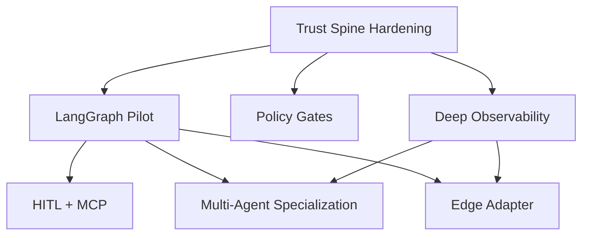

# Phase 19 Masterplan — Transition to an Autonomous TypeScript AI Coding System

_Last updated: 2025-10-12_

---

## 1. Strategic Decision-Making Framework

| Dimension | Guardrails | Decision Signals | Source Evidence |
| --- | --- | --- | --- |
| **Stack Discipline** | Preserve TypeScript-only contract (ai-stack.json), Node 20 runtime lock, vanilla JS frontend. | Reject proposals introducing Python runtimes or frontend frameworks; prioritize frameworks with TS-first support and MCP compatibility. | Claude research shows TS agent frameworks at Fortune 500 scale (LangGraph.js, Vercel AI SDK 5, OpenAI Agents SDK, Cloudflare Agents SDK).【F:docs/Goal_&_Vision_inspirational_only/03_final_decisions/01a_final_research_Claude.md†L1-L64】 |
| **Operational Maturity** | Maintain CDI gates (discovery → implementation → evidence → validation) with SBOM, contract validation, and stack checks. | Require feature flags, parity testing, and telemetry coverage before default switches; ensure zero warning CI runs. | GPT_HIGH roadmap emphasizes “Trust Spine vNext” (CycloneDX, RFC 9457, OTel, JSONL logs) as prerequisite before orchestrator swaps.【F:docs/Goal_&_Vision_inspirational_only/03_final_decisions/01c_final_research_GPT_HIGH.md†L5-L62】 |
| **Orchestration Control** | Prefer deterministic graph runtimes with HITL checkpoints and resumability. | Adopt LangGraph.js under feature flag with StepQueue fallback; enforce human approvals for high-risk steps. | GPT_RA outlines phased adoption of LangGraph.js with HITL and MCP tooling under feature flags.【F:docs/Goal_&_Vision_inspirational_only/03_final_decisions/01b_final_research_GPT_RA.md†L19-L91】 |
| **Compliance & Governance** | Extend CDI evidence bundles to cover GenAI spans, policy scans, MCP tool audits, and RFC 9457 responses. | Add new CDI gate artifacts (trace exports, MCP policy ledgers, semgrep/gitleaks reports) before graduating phases. | GPT_HIGH defines policy gates (ASVS v5, LLM Top-10, NIST CSF 2.0) layered after Trust Spine; CDI quick reference enumerates current evidence obligations.【F:docs/Goal_&_Vision_inspirational_only/03_final_decisions/01c_final_research_GPT_HIGH.md†L63-L146】【F:CDI_INFRASTRUCTURE.md†L1-L116】 |
| **Risk Management** | Track risks in `.automation` ledgers with mitigation owners. | Trigger go/no-go reviews when residual risk > Medium or telemetry gaps persist. | GPT_RA and GPT_HIGH both call out telemetry, learning curve, and policy drift risks requiring feature flags and audits.【F:docs/Goal_&_Vision_inspirational_only/03_final_decisions/01b_final_research_GPT_RA.md†L92-L214】【F:docs/Goal_&_Vision_inspirational_only/03_final_decisions/01c_final_research_GPT_HIGH.md†L147-L214】 |

**Decision cadence:**
1. **Discovery Validation:** Every change begins with refreshed discovery artifacts (JSON + note) citing integration points, as mandated by CDI.【F:CDI_INFRASTRUCTURE.md†L1-L76】
2. **Design Review Gate:** Architecture proposals are checked against this framework, ensuring TypeScript compliance, observability readiness, and feature flag strategy before implementation.
3. **Evidence Ledger Update:** Implementation cannot ship without updated evidence (tests, traces, SBOM, contract checks) archived under `.automation/fixtures/`.
4. **Operations Readiness Review:** Post-implementation, runbook, rollback plan, and telemetry dashboards must be verified before enabling new runtimes by default.

---

## 2. Comparative Analysis of Final Research Findings

| Criteria | Claude Final Research | GPT_RA Final Research | GPT_HIGH Final Research | Synthesis |
| --- | --- | --- | --- | --- |
| **Primary Focus** | Establishes TypeScript ecosystem viability and enterprise adoption proof points (Klarna, Uber, LinkedIn).【F:docs/Goal_&_Vision_inspirational_only/03_final_decisions/01a_final_research_Claude.md†L1-L88】 | Repo-aware phased roadmap integrating LangGraph.js, OTel, MCP, and HITL streams with feature flags.【F:docs/Goal_&_Vision_inspirational_only/03_final_decisions/01b_final_research_GPT_RA.md†L19-L115】 | Trust spine, governance, and observability hardening before multi-agent expansion; detailed session plans.【F:docs/Goal_&_Vision_inspirational_only/03_final_decisions/01c_final_research_GPT_HIGH.md†L5-L146】 | Combine Claude’s viability proof with GPT_RA’s orchestrator roadmap and GPT_HIGH’s compliance-first sequencing. |
| **Strengths** | Evidence-rich survey of TS frameworks, MCP maturity, and hybrid architecture guidance.【F:docs/Goal_&_Vision_inspirational_only/03_final_decisions/01a_final_research_Claude.md†L65-L176】 | Concrete repo integration points, durations, and HITL controls tied to existing modules (planner, runner, etc.).【F:docs/Goal_&_Vision_inspirational_only/03_final_decisions/01b_final_research_GPT_RA.md†L116-L206】 | Explicit CDI-aligned gates (CycloneDX, RFC 9457, JSONL logs) and policy guardrails (ASVS, LLM Top-10).【F:docs/Goal_&_Vision_inspirational_only/03_final_decisions/01c_final_research_GPT_HIGH.md†L63-L214】 | Strengths reinforce a TypeScript-first, CDI-governed rollout with measurable telemetry and compliance. |
| **Gaps / Risks** | Less detail on CDI evidence mechanics and internal repo specifics. | Assumes telemetry and trust spine already in place; needs sequencing with compliance upgrades. | Focuses on trust/compliance, less on external ecosystem validation beyond tooling choices. | Roadmap must interleave trust spine upgrades with orchestrator rollout to close gaps. |
| **Recommended Adoption** | Use as market validation and criteria for framework/tool selection; informs exec buy-in. | Treat as orchestration and MCP execution plan; adopt session breakdown for implementation backlog. | Use for governance, telemetry, and risk gating; adopt trust spine milestones before autonomy toggles. | Adopt all three: sequence governance (GPT_HIGH) → orchestrator (GPT_RA) supported by ecosystem confidence (Claude). |

---

## 3. Decision on Optimal Path Forward

**Decision:** Execute a CDI-governed, TypeScript-only transition in three macro tracks—(1) Trust Spine Hardening, (2) Feature-flagged LangGraph Orchestration with HITL, and (3) MCP-enabled Chat Operations—culminating in autonomous mode activation only after telemetry, compliance, and policy gates are green.

**Justification:**
- Claude confirms TypeScript frameworks now meet Fortune 500 readiness, enabling us to stay within ai-stack constraints without sacrificing capability.【F:docs/Goal_&_Vision_inspirational_only/03_final_decisions/01a_final_research_Claude.md†L1-L146】
- GPT_RA provides repo-specific integrations and sequencing for LangGraph, MCP, and telemetry under feature flags, minimizing blast radius.【F:docs/Goal_&_Vision_inspirational_only/03_final_decisions/01b_final_research_GPT_RA.md†L19-L206】
- GPT_HIGH ensures we reinforce CDI trust spine (CycloneDX, RFC 9457, OTel spans, JSONL logs) before autonomy, satisfying governance requirements documented in CDI infrastructure.【F:docs/Goal_&_Vision_inspirational_only/03_final_decisions/01c_final_research_GPT_HIGH.md†L5-L146】【F:CDI_INFRASTRUCTURE.md†L1-L116】

**Go/No-Go Criteria:**
1. Trust spine artifacts (CycloneDX SBOM, RFC 9457 responses, OTel baseline, JSONL action logs) exist and are validated in CI.
2. LangGraph runtime demonstrates parity in controlled environments with StepQueue fallback and HITL checkpoints.
3. MCP tool server and vanilla JS chat UI pass security audits (allow-lists, audit logs, rate limits).
4. Policy scans (Semgrep LLM Top-10, Gitleaks, npm audit) integrated into CDI gates with zero outstanding high risks.

---

## 4. CDI Framework Updates & Required Modifications

1. **Evidence Expansion**
   - Add CycloneDX generation to `npm run sbom`, produce `sbom.cdx.json`, and archive artifacts per GPT_HIGH Trust Spine.【F:docs/Goal_&_Vision_inspirational_only/03_final_decisions/01c_final_research_GPT_HIGH.md†L13-L46】
   - Extend evidence ledger templates to capture OTel trace exports, MCP policy files, and RFC 9457 problem+json samples.

2. **Telemetry & Logging Controls**
   - Introduce `src/telemetry/otel.ts` bootstrap (env-guarded) and ensure `logEvent` dual-writes JSONL for SIEM feeds before autonomy toggles.【F:docs/Goal_&_Vision_inspirational_only/03_final_decisions/01c_final_research_GPT_HIGH.md†L29-L46】

3. **Contract & Gate Enhancements**
   - Update CDI contracts to include LangGraph feature flag rollout steps, HITL approval evidence, and MCP policy checks (align with GPT_RA session plan).【F:docs/Goal_&_Vision_inspirational_only/03_final_decisions/01b_final_research_GPT_RA.md†L116-L214】
   - Incorporate governance scans (ASVS v5, LLM Top-10, NIST CSF mappings) into `npm run validate:all` or dedicated CI stages.【F:docs/Goal_&_Vision_inspirational_only/03_final_decisions/01c_final_research_GPT_HIGH.md†L147-L214】

4. **Discovery Protocol Reinforcement**
   - Mandate refreshed discovery notes for each LangGraph node, telemetry module, and MCP tool addition, ensuring file-line references remain current as orchestrator structure evolves.【F:CDI_INFRASTRUCTURE.md†L1-L76】

5. **Risk Ledger Integration**
   - Add residual risk scoring (learning curve, telemetry overhead, policy drift) to `.automation` progress logs so Phase 19 milestones capture mitigation status from GPT research outputs.【F:docs/Goal_&_Vision_inspirational_only/03_final_decisions/01b_final_research_GPT_RA.md†L206-L310】【F:docs/Goal_&_Vision_inspirational_only/03_final_decisions/01c_final_research_GPT_HIGH.md†L147-L214】

---

## 5. Roadmap, Milestones, Dependencies, and Risk Mitigation

### 5.1 Macro Timeline Overview

| Phase | Duration | Dependencies | Key Outcomes | Risks & Mitigations |
| --- | --- | --- | --- | --- |
| **T0 – Trust Spine Hardening** | 2 weeks | None | CycloneDX SBOM, RFC 9457 middleware, OTel baseline, JSONL action log. | _Risk:_ CI complexity ↑. _Mitigation:_ Feature flag telemetry; add smoke tests for OTEL_ENABLED flows.【F:docs/Goal_&_Vision_inspirational_only/03_final_decisions/01c_final_research_GPT_HIGH.md†L13-L62】 |
| **M1 – LangGraph Orchestration Pilot** | 3 weeks | T0 | LangGraph runtime under `AGENTS_RUNTIME=langgraph`, StepQueue fallback, parity tests. | _Risk:_ Learning curve & regressions. _Mitigation:_ Feature flag, parity unit tests per GPT_RA sessions.【F:docs/Goal_&_Vision_inspirational_only/03_final_decisions/01b_final_research_GPT_RA.md†L19-L146】 |
| **U1 – HITL Chat & MCP Tools** | 2 weeks | M1 | Vanilla JS chat UI, MCP server with read-only FS/Git/HTTP, HITL approvals streamed via SSE. | _Risk:_ Tool sprawl, auth gaps. _Mitigation:_ Allow-listed MCP policies, audit logs, rate limits.【F:docs/Goal_&_Vision_inspirational_only/03_final_decisions/01b_final_research_GPT_RA.md†L147-L214】 |
| **P1 – Policy Gates & Compliance** | 2 weeks | T0 | Semgrep LLM Top-10, Gitleaks, npm audit gating, governance mapping. | _Risk:_ False positives. _Mitigation:_ Suppression workflow, CDI waiver logging.【F:docs/Goal_&_Vision_inspirational_only/03_final_decisions/01c_final_research_GPT_HIGH.md†L147-L214】 |
| **O1 – Deep Observability & Eval Harness** | 2 weeks | T0, M1 | Per-step GenAI spans, Langfuse integration, eval logging for plan/repair loops. | _Risk:_ Telemetry overhead. _Mitigation:_ Sampling controls, env flags, redaction policy.【F:docs/Goal_&_Vision_inspirational_only/03_final_decisions/01c_final_research_GPT_HIGH.md†L115-L214】 |
| **MA2 – Multi-Agent Specialization** | 3 weeks | M1, O1 | Role-specific agents (RA/AA/SA/QA/DBA/DA) with evidence bundles. | _Risk:_ Workflow drift. _Mitigation:_ CDI-led discovery per agent, evidence index automation.【F:docs/Goal_&_Vision_inspirational_only/03_final_decisions/01c_final_research_GPT_HIGH.md†L147-L214】 |
| **E2 – Edge Deployment (Optional)** | 2-3 weeks | M1, O1 | Cloudflare Agents or Vercel AI SDK edge adapter. | _Risk:_ Vendor coupling. _Mitigation:_ Adapter abstraction, optional rollout, fallback plan.【F:docs/Goal_&_Vision_inspirational_only/03_final_decisions/01b_final_research_GPT_RA.md†L215-L260】【F:docs/Goal_&_Vision_inspirational_only/03_final_decisions/01c_final_research_GPT_HIGH.md†L214-L271】 |

### 5.2 Milestone Detail & Dependencies

1. **Milestone A – Trust Spine Complete (T0)**
   - Deliverables: `sbom.cdx.json`, RFC 9457 middleware tests, `src/telemetry/otel.ts`, JSONL log samples.
   - Dependency Resolution: None; unlocks LangGraph pilot and compliance scans.
   - Risk Mitigation: Introduce OTEL_ENABLED guard, run `npm run sbom` in CI nightly.

2. **Milestone B – LangGraph Pilot Ready (M1)**
   - Deliverables: `src/orchestration/graph.ts`, parity Vitest suite, feature flag toggles.
   - Dependencies: Trust spine telemetry for debugging; ensures orchestrator events captured.
   - Risk Mitigation: Keep StepQueue default; require successful dry-run evidence before enabling flag.

3. **Milestone C – HITL & MCP Operational (U1)**
   - Deliverables: `/public/chat.*`, SSE approval flow, `packages/mcp-server/` with policy docs.
   - Dependencies: LangGraph events for UI streaming; trust spine logs for audit trail.
   - Risk Mitigation: Rate limiting via Express middleware; tool allow-list review.

4. **Milestone D – Governance Gates Integrated (P1)**
   - Deliverables: CI jobs for Semgrep, Gitleaks, npm audit; governance mapping doc.
   - Dependencies: Trust spine artifacts for evidence baseline.
   - Risk Mitigation: Document waiver workflow in `.automation/progress_phase19.json`.

5. **Milestone E – Observability & Evaluations (O1)**
   - Deliverables: Span instrumentation, Langfuse config, evaluation harness.
   - Dependencies: Trust spine telemetry base; orchestrator events.
   - Risk Mitigation: Sampling + redaction policy; cross-team review before enabling exporters.

6. **Milestone F – Role-Specialized Autonomy (MA2)**
   - Deliverables: Agent subgraphs with evidence bundle automation.
   - Dependencies: Observability (for per-step spans) and governance (for audit compliance).
   - Risk Mitigation: Gate each new agent behind discovery sign-offs and tests.

7. **Milestone G – Edge Adapter (E2, optional)**
   - Deliverables: Worker adapter, deployment runbook.
   - Dependencies: LangGraph stable API, telemetry exporters.
   - Risk Mitigation: Blue/green deploy with StepQueue fallback; cost monitoring.

### 5.3 Implementation Dependencies & Sequencing

### 5.4 Risk Register Snapshot

| Risk ID | Description | Likelihood | Impact | Mitigation | Owner |
| --- | --- | --- | --- | --- | --- |
| R1 | LangGraph learning curve delays rollout. | Medium | High | Maintain StepQueue default; require parity tests; pair programming sessions on graph API.【F:docs/Goal_&_Vision_inspirational_only/03_final_decisions/01b_final_research_GPT_RA.md†L19-L146】 | Orchestration Lead |
| R2 | Telemetry overhead affects latency. | Medium | Medium | Env-guard OTel, configure sampling, monitor CPU/memory before prod toggle.【F:docs/Goal_&_Vision_inspirational_only/03_final_decisions/01c_final_research_GPT_HIGH.md†L115-L214】 | Observability Lead |
| R3 | MCP tool sprawl introduces security gaps. | Low | High | Enforce allow-lists, rate limits, audit logging, periodic policy review with security team.【F:docs/Goal_&_Vision_inspirational_only/03_final_decisions/01b_final_research_GPT_RA.md†L147-L214】 | Security Lead |
| R4 | Policy scans produce false positives blocking delivery. | Medium | Medium | Implement waiver workflow in CDI evidence ledger; schedule weekly triage review.【F:docs/Goal_&_Vision_inspirational_only/03_final_decisions/01c_final_research_GPT_HIGH.md†L147-L214】 | Governance Lead |
| R5 | Prompt templates drifting toward Python references. | Medium | Medium | Audit clarify prompts, update tests enforcing TS-only guidance per discovery note risk list.【F:.automation/phase19_autonomous_transition_discovery_note.md†L88-L120】 | Prompt Steward |

---

## 6. Next Actions Checklist (Phase 19 Kick-off)

1. Approve this masterplan via CDI gate review and archive in `.automation/phase19_autonomous_transition_discovery.json` evidence list.
2. Spin up Milestone A backlog tickets (CycloneDX script, RFC 9457 middleware, OTel bootstrap, JSONL logging) with discovery updates.
3. Establish risk ledger entries R1–R5 in `.automation/progress_phase19.json` with owners and review cadence.
4. Schedule feature flag rollout plan for LangGraph (`AGENTS_RUNTIME`) including rollback procedures and telemetry dashboards.
5. Align security & governance teams on MCP policy templates, Semgrep/Gitleaks rules, and evidence archiving expectations.

This framework keeps the transition CDI-compliant, TypeScript-pure, and auditable while phasing autonomy behind trust, observability, and governance milestones.
