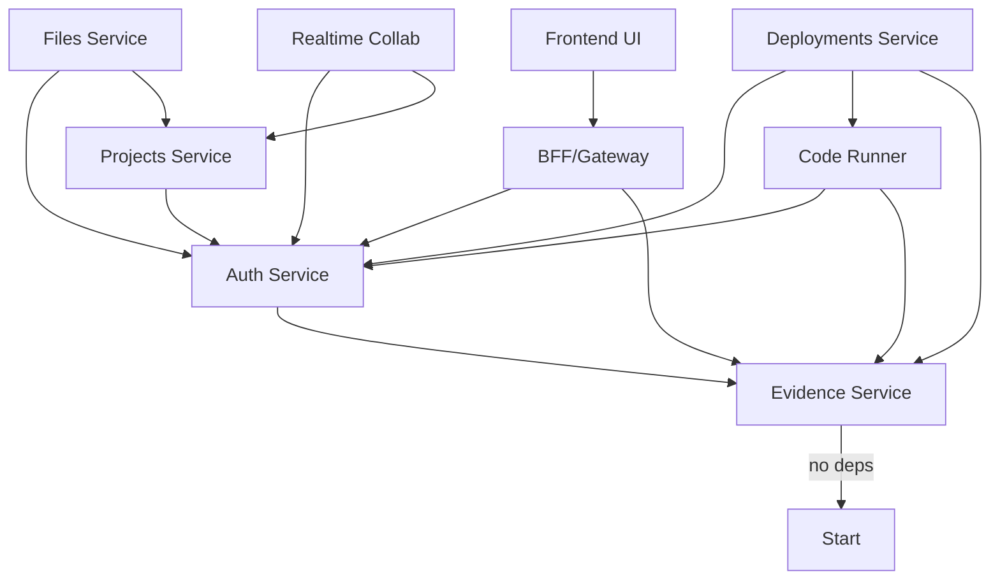

# Refinement Round 2: Critical Gaps - SHIP PERFECT OR NEVER

**Context:** Your previous delivery (10_the_how_delivery.md) scored **77/100** - good research, but **NOT BUILD-READY**. We follow **"ship perfect or never"** - missing 23% means we don't ship.

**Rule #1 Violations Found:**
- ❌ Incomplete API contracts (5 of 7 services partial/missing)
- ❌ No service-to-service authentication (BFF can't call Files/Runner/etc.)
- ❌ No observability dashboards (can't debug production)
- ❌ No deployment sequence (services have dependencies, undefined order)
- ❌ No cost estimation (could be $500/mo or $50K/mo - unknown)
- ❌ Missing migration strategy (zero-downtime deploys impossible)
- ❌ Incomplete database relationships (cascading deletes undefined)

**Non-negotiable:** Every gap below must be filled with **copy-paste-ready, October 2025 current, evidence-backed (3+ sources) specifications**. Anything vague, outdated, or "figure it out yourself" violates Rule #1.

---

## 🚨 CRITICAL GAPS (BLOCKERS)

### Gap 1: Complete All API Contracts (100% Coverage Required)

**Problem:** Only BFF Projects API is complete. 5 services are partial or missing entirely.

**Required Output:** Full OpenAPI 3.1 specs for ALL services below.

---

#### 1.1 Auth & IAM Service API (Currently: ZERO spec provided)

**Endpoints to specify:**

```yaml
# USER FLOWS
POST   /auth/register              # Create user account
POST   /auth/login                 # Email+password or social login
POST   /auth/verify-email          # Email verification token
POST   /auth/reset-password        # Request password reset
POST   /auth/reset-password/confirm # Complete password reset
POST   /auth/logout                # Invalidate session
POST   /auth/refresh               # Refresh access token
GET    /auth/me                    # Get current user info

# WEBAUTHN (PASSKEYS)
POST   /auth/webauthn/register/begin    # Start passkey registration
POST   /auth/webauthn/register/complete # Complete passkey registration
POST   /auth/webauthn/login/begin       # Start passkey login
POST   /auth/webauthn/login/complete    # Complete passkey login

# OAUTH/OIDC (SOCIAL LOGIN)
GET    /auth/oauth/{provider}/authorize # GitHub, Google, etc.
GET    /auth/oauth/{provider}/callback  # OAuth callback handler

# SERVICE-TO-SERVICE (CRITICAL - MISSING ENTIRELY)
POST   /auth/service-tokens        # Generate service account token
POST   /auth/service-tokens/verify # Verify service token
DELETE /auth/service-tokens/{id}   # Revoke service token

# ADMIN
GET    /admin/users                # List users (paginated)
PATCH  /admin/users/{id}           # Update user (role, status)
DELETE /admin/users/{id}           # Delete user account
```

**For EACH endpoint, provide:**
- Complete request/response schemas (JSON Schema 2020-12)
- All error cases (400, 401, 403, 404, 409, 422, 429, 500, 503)
- Rate limits (per IP? per user? Redis-backed?)
- Idempotency where applicable
- OAuth scopes required
- Example curl commands

**Service-to-Service Auth (CRITICAL):**
- Which approach: OAuth 2.0 Client Credentials? Mutual TLS? API Keys? JWT with service claims?
- Show token structure (if JWT: what claims? exp? iss? aud?)
- How does BFF authenticate to Files service? (code example)
- How does Code Runner authenticate to Evidence service? (code example)
- Token rotation strategy? Expiration? Refresh?
- Where stored? (Kubernetes Secrets? External Secrets Operator? Vault?)

**Evidence required:**
- RFC 9068 (JWT access tokens)
- OAuth 2.0 Client Credentials flow (RFC 6749 Section 4.4)
- Mutual TLS guidance (if chosen) - NIST, OWASP
- Supabase Auth API reference (current Oct 2025)
- Ory Kratos/Hydra API docs (if self-hosted approach)
- Auth0 Management API (comparable patterns)
- Example from production APIs: Stripe service accounts? GitHub Apps auth?

---

#### 1.2 Realtime Collaboration Service API (Currently: 3 endpoints, incomplete)

**Your delivery had:**
```yaml
POST   /api/collab/documents           # Create doc
GET    /api/collab/documents/{id}      # Get snapshot
GET    /api/collab/documents/{id}/presence # Get presence
```

**MISSING (add these):**

```yaml
# DOCUMENT MANAGEMENT
GET    /api/collab/documents           # List user's documents (paginated)
PATCH  /api/collab/documents/{id}      # Update metadata (title, permissions)
DELETE /api/collab/documents/{id}      # Delete document
POST   /api/collab/documents/{id}/fork # Fork/copy document

# COLLABORATION
POST   /api/collab/documents/{id}/share      # Share with user/team
DELETE /api/collab/documents/{id}/share/{userId} # Revoke access
GET    /api/collab/documents/{id}/collaborators # List collaborators

# HISTORY & VERSIONS
GET    /api/collab/documents/{id}/history    # List snapshots/versions
POST   /api/collab/documents/{id}/snapshot   # Create named snapshot
POST   /api/collab/documents/{id}/restore    # Restore to snapshot

# COMMENTS/ANNOTATIONS (if in MVP)
POST   /api/collab/documents/{id}/comments   # Add comment/annotation
GET    /api/collab/documents/{id}/comments   # List comments
PATCH  /api/collab/comments/{id}             # Edit comment
DELETE /api/collab/comments/{id}             # Delete comment

# WEBSOCKET PROTOCOL SPEC (CRITICAL)
WS     /api/collab/documents/{id}/ws         # Yjs sync protocol
```

**For WebSocket, specify:**
- Connection handshake (auth token in URL query? header? first message?)
- Yjs sync protocol messages (show examples: sync-step-1, sync-step-2, update, awareness)
- Presence protocol (cursor position, selection, user info format)
- Heartbeat/keepalive (interval? timeout?)
- Reconnection strategy (client-side: exponential backoff with jitter)
- Error messages (unauthorized, document not found, rate limited)
- Binary message format (Yjs encodes as Uint8Array)

**Persistence details:**
- How often to snapshot? (every N updates? every M minutes?)
- Delta storage vs full snapshots? (hybrid approach?)
- Garbage collection (old deltas cleanup strategy)
- PostgreSQL schema for storing Yjs state (show the schema)

**Evidence required:**
- Yjs sync protocol documentation (official)
- y-websocket server implementation (GitHub repo, current version)
- Liveblocks Yjs integration (patterns, current 2025)
- Figma's CRDT architecture (if documented publicly)
- WebSocket message format examples (MDN, RFC 6455)

---

#### 1.3 Code Runner Service API (Currently: partial, missing artifacts)

**Your delivery had:**
```yaml
POST   /api/runs               # Start execution
GET    /api/runs/{id}          # Get status
GET    /api/runs/{id}/logs     # Stream logs (SSE)
POST   /api/runs/{id}/stop     # Kill process
GET    /api/runs/{id}/artifacts # List artifacts (INCOMPLETE)
```

**MISSING/INCOMPLETE (fix these):**

```yaml
# ARTIFACTS (EXPAND - currently just "list URLs")
GET    /api/runs/{id}/artifacts              # List artifacts with metadata
GET    /api/runs/{id}/artifacts/{path}       # Download specific artifact (presigned URL)
POST   /api/runs/{id}/artifacts              # Upload artifact during run
DELETE /api/runs/{id}/artifacts/{path}       # Delete artifact

# RESOURCE MONITORING (NEW - essential for autonomy)
GET    /api/runs/{id}/metrics                # CPU/memory/disk usage (real-time)
GET    /api/runs/{id}/metrics/history        # Historical resource usage

# EXECUTION ENVIRONMENT (NEW)
POST   /api/environments                     # Create custom runtime environment
GET    /api/environments                     # List available environments
GET    /api/environments/{id}                # Get environment details
DELETE /api/environments/{id}                # Delete environment

# BATCH OPERATIONS (NEW - for multi-step agent runs)
POST   /api/runs/batch                       # Queue multiple runs
GET    /api/runs/batch/{batchId}             # Get batch status
POST   /api/runs/batch/{batchId}/cancel      # Cancel entire batch
```

**Isolation implementation details (CRITICAL):**
- **Firecracker**: Show VM configuration (kernel, rootfs, vcpu, memory, network setup)
- **gVisor**: Show runsc runtime config, syscall filters, resource limits
- Which to use WHEN? (Firecracker for max isolation + Lambda-scale? gVisor for K8s simplicity?)
- Container image pull strategy (pre-pull? on-demand? registry caching?)
- Network isolation (no internet? allowlist domains? proxy?)
- File system isolation (tmpfs? persistent volume? size limits?)

**Log streaming details:**
- SSE message format (show examples: `data: {"level":"info","msg":"Building..."}\n\n`)
- How to handle large logs? (truncation? pagination? streaming compression?)
- Log persistence (where stored? S3? Loki? retention policy?)
- Real-time vs historical logs (WebSocket for real-time, HTTP for historical?)

**Evidence required:**
- Firecracker MicroVM configuration (official docs, examples)
- gVisor production deployment guide (Google, current 2025)
- AWS Lambda execution environment (comparable isolation model)
- Replit Code Runner architecture (if documented)
- GitHub Actions runner isolation (comparable patterns)

---

#### 1.4 Deployments/Environments Service API (Currently: sketch only)

**Your delivery had:**
```yaml
POST   /api/environments          # Create environment
POST   /api/deployments           # Deploy to environment
POST   /api/deployments/{id}/rollback # Rollback (INCOMPLETE)
GET    /api/deployments/{id}/logs # Deployment logs (MISSING)
```

**MISSING/INCOMPLETE (expand to full API):**

```yaml
# ENVIRONMENTS
POST   /api/environments                     # Create env (preview/staging/prod)
GET    /api/environments                     # List environments (paginated)
GET    /api/environments/{id}                # Get environment details
PATCH  /api/environments/{id}                # Update config (env vars, limits)
DELETE /api/environments/{id}                # Delete environment
GET    /api/environments/{id}/health         # Environment health status

# DEPLOYMENTS
POST   /api/deployments                      # Deploy to environment
GET    /api/deployments                      # List deployments (paginated, filterable)
GET    /api/deployments/{id}                 # Get deployment details
POST   /api/deployments/{id}/promote         # Promote preview→staging→prod
POST   /api/deployments/{id}/rollback        # Rollback to previous version (COMPLETE THIS)
POST   /api/deployments/{id}/cancel          # Cancel in-progress deployment
GET    /api/deployments/{id}/logs            # Deployment logs (streaming)
GET    /api/deployments/{id}/metrics         # Deployment metrics (success rate, latency)

# PREVIEW URLs (CRITICAL FOR NON-TECHNICAL FOUNDER PERSONA)
GET    /api/deployments/{id}/preview-url     # Get preview URL
POST   /api/deployments/{id}/preview-url/refresh # Regenerate preview URL

# CONFIGURATION
GET    /api/environments/{id}/config         # Get env vars, secrets
PATCH  /api/environments/{id}/config         # Update env vars (triggers redeploy?)
POST   /api/environments/{id}/config/secrets # Add secret (encrypted)
DELETE /api/environments/{id}/config/secrets/{key} # Remove secret

# HEALTH & MONITORING
GET    /api/environments/{id}/status         # Current deployment status
GET    /api/environments/{id}/incidents      # List incidents/failures
POST   /api/environments/{id}/health-check   # Trigger manual health check
```

**Deployment strategies (SPECIFY):**
- **Rolling deployment**: Show configuration (max surge, max unavailable, readiness probe config)
- **Blue-green**: Show cutover process (switch traffic, DNS/routing update, rollback procedure)
- **Canary**: Show progressive rollout (10% → 50% → 100%, metrics to watch, auto-rollback triggers)
- Which is MVP default? (rolling for simplicity?)

**Preview URL implementation:**
- Subdomain per preview? (`pr-123.preview.example.com`)
- Path-based? (`example.com/preview/pr-123`)
- Wildcard DNS setup? (CloudFlare? Route53?)
- TLS certificate provisioning? (Let's Encrypt wildcard? cert-manager?)
- Lifecycle management? (TTL? manual deletion? auto-delete on PR merge?)

**Rollback mechanics (CRITICAL - currently just "POST /rollback"):**
- What gets rolled back? (code? DB schema? env vars? all?)
- Rollback to which version? (previous? specific version?)
- How fast? (immediate traffic switch? gradual rollback?)
- Data migrations during rollback? (forward-only? reversible?)
- Rollback testing? (can we dry-run a rollback?)

**Evidence required:**
- Kubernetes rolling update strategy (official docs, current 2025)
- Vercel deployments & previews (API reference, current 2025)
- Netlify deploy contexts (preview/production patterns)
- Argo Rollouts progressive delivery (canary/blue-green examples)
- Flagger automated canary deployments (metrics-driven rollout)

---

#### 1.5 Evidence/Compliance Service API (Currently: 2 endpoints, missing generation)

**Your delivery had:**
```yaml
POST   /api/evidence/bundles      # Create bundle (MANUAL - not realistic)
GET    /api/evidence/bundles/{id}/verify # Verify signature
```

**MISSING (the actual generation endpoints):**

```yaml
# SBOM GENERATION (CRITICAL - how do we CREATE SBOMs?)
POST   /api/sbom/generate                    # Generate SBOM for image/project
GET    /api/sbom/{id}                        # Get SBOM (CycloneDX or SPDX)
GET    /api/sbom                             # List SBOMs (paginated)
POST   /api/sbom/{id}/sign                   # Sign SBOM with cosign

# SLSA PROVENANCE GENERATION (CRITICAL)
POST   /api/provenance/generate              # Generate SLSA provenance
GET    /api/provenance/{id}                  # Get provenance
POST   /api/provenance/{id}/sign             # Sign provenance

# EVIDENCE BUNDLES (AUTO-CREATED, not manual POST)
GET    /api/evidence/bundles                 # List bundles (paginated)
GET    /api/evidence/bundles/{id}            # Get bundle (DSSE envelope)
GET    /api/evidence/bundles/{id}/verify     # Verify signature
POST   /api/evidence/bundles/{id}/attest     # Attest to bundle (additional signatures)

# ATTESTATIONS (NEW - for human approvals)
POST   /api/attestations                     # Create attestation (human approval at gate)
GET    /api/attestations                     # List attestations
GET    /api/attestations/{id}                # Get attestation details

# AUDIT TRAIL (NEW - immutable log)
GET    /api/audit/events                     # List audit events (paginated, filterable)
GET    /api/audit/events/{id}                # Get event details
POST   /api/audit/export                     # Export audit log (compliance reports)
```

**Implementation details (CRITICAL - you showed storage but not generation):**

**SBOM Generation:**
- Which tool? (Syft? Trivy? Both? Which is faster/more accurate Oct 2025?)
- Where does it run? (as part of deployment? on-demand? scheduled?)
- How long does it take? (async job? webhook when complete?)
- Which packages included? (runtime? dev deps? OS packages? all?)
- Format conversion? (CycloneDX ↔ SPDX)

**SLSA Provenance:**
- Which SLSA level? (L1, L2, L3?)
- What metadata captured? (builder identity, materials, invocation, timestamps)
- Where does build happen? (GitHub Actions? separate builder service?)
- How to link provenance to image? (OCI image manifest? separate storage?)

**Signing:**
- Keyless signing (Sigstore/cosign with OIDC)?
- Key-based signing (where are keys stored? KMS? Vault? HSM?)
- Who can sign? (CI service account? human approvers? both?)
- Multi-signature support? (e.g., 2 of 3 approvers must sign)

**Storage:**
- PostgreSQL for metadata? (immutable table as shown in your delivery)
- Blob storage for actual artifacts? (S3 with Object Lock? Content-addressed?)
- Retention policy? (forever? legal hold? GDPR right-to-deletion conflict?)

**Evidence required:**
- Syft SBOM generation (Anchore docs, current Oct 2025 version)
- Trivy SBOM generation (Aqua Security docs, comparison with Syft)
- SLSA v1.0 provenance schema (slsa.dev official spec)
- Sigstore/cosign keyless signing (how it works, current 2025 best practices)
- in-toto attestation framework (DSSE envelope format)

---

### Gap 2: Service-to-Service Authentication (COMPLETE SPEC REQUIRED)

**Problem:** Your delivery shows user authentication (OAuth 2.1, JWT) but ZERO guidance on how services authenticate to each other.

**Example scenario:**
```
User → BFF → Files service
           ↓
           Code Runner → Evidence service
```

**Questions unanswered:**
1. How does BFF prove to Files that it's allowed to call it?
2. How does Code Runner prove to Evidence that it's a legitimate service?
3. Can a compromised user JWT be replayed to call internal services?

**Required output:**

#### 2.1 Choose ONE approach (with full implementation)

**Option A: OAuth 2.0 Client Credentials Flow**
- Show client registration (how does BFF get client_id/client_secret?)
- Show token exchange (BFF → Auth service → get service token)
- Show token verification (Files service verifies BFF's token)
- Token caching strategy (how long cached? when refreshed?)
- Code examples (TypeScript middleware for both client and server)

**Option B: Mutual TLS (mTLS)**
- Show certificate generation (per service? per namespace?)
- Show certificate distribution (Kubernetes secrets? cert-manager?)
- Show TLS config (Node.js https.Agent with client cert)
- Certificate rotation strategy (automated? manual? cert-manager?)
- Code examples (Express server with client cert verification)

**Option C: API Keys (simplest but less secure)**
- Show key generation (cryptographically random? how long?)
- Show key storage (Kubernetes secrets? External Secrets? Vault?)
- Show key rotation (automated? manual? blue-green key rollover?)
- Rate limiting per key? (Redis-backed? in-memory?)
- Code examples (middleware to verify API key)

**Option D: JWT with Service Claims (extend user JWT approach)**
- Show service JWT structure (which claims? `sub=service:bff`, `aud=files-service`?)
- Show signing (shared secret? asymmetric keys? who signs service JWTs?)
- Show verification (same JWKS as user tokens? separate?)
- Token expiration (short-lived? long-lived with rotation?)
- Code examples (generate service JWT, verify in middleware)

**Evidence required (for chosen approach):**
- RFC 6749 Section 4.4 (OAuth Client Credentials) OR
- NIST guidance on mTLS (SP 800-52 Rev 2) OR
- OWASP API Security (API keys best practices) OR
- RFC 7519 (JWT) with service-to-service patterns
- 3+ production examples: Stripe internal auth? Google service accounts? AWS IAM roles?

**Code examples required:**
```typescript
// Client side (BFF calling Files service)
import { /* show imports */ } from '...';

async function callFilesService(path: string) {
  // Show: how to get service token/cert/key
  // Show: how to add auth to HTTP request
  // Show: how to handle 401 (token expired, refresh)
}

// Server side (Files service verifying BFF)
import { /* show imports */ } from '...';

function verifyServiceAuth(req, res, next) {
  // Show: extract token/cert/key from request
  // Show: verify authenticity
  // Show: extract service identity (which service is calling?)
  // Show: check permissions (is BFF allowed to call this endpoint?)
  next();
}
```

---

### Gap 3: Complete Database Schema with Relationships

**Problem:** Tables exist but foreign keys incomplete, cascading deletes undefined.

**Required output:**

#### 3.1 Complete ER Diagram (ASCII or Mermaid)

```
┌─────────────┐       ┌─────────────┐
│   tenants   │───┬───│    users    │
└─────────────┘   │   └─────────────┘
                  │          │
                  │          │ owner_id
                  │          ↓
┌─────────────┐   │   ┌─────────────┐
│   projects  │←──┘   │    runs     │
└─────────────┘       └─────────────┘
       │                     │
       │ project_id          │ run_id
       ↓                     ↓
┌─────────────┐       ┌─────────────┐
│    files    │       │  evidence   │
└─────────────┘       └─────────────┘
       │
       │ file_id
       ↓
┌─────────────┐
│ collab_docs │
└─────────────┘
```

**Show ALL relationships:**
- Which tables reference which?
- Which foreign keys have `ON DELETE CASCADE`?
- Which have `ON DELETE SET NULL`?
- Which have `ON DELETE RESTRICT` (prevent deletion)?

#### 3.2 Add Missing Tables

**Your delivery had:** `projects`, `files`, `runs`, `users`, `evidence_bundles`

**MISSING:**
```sql
-- Tenants (multi-tenancy root)
CREATE TABLE tenants (
  id UUID PRIMARY KEY DEFAULT gen_random_uuid(),
  name TEXT NOT NULL,
  slug TEXT UNIQUE NOT NULL,
  plan TEXT NOT NULL CHECK (plan IN ('free','pro','enterprise')),
  created_at TIMESTAMPTZ NOT NULL DEFAULT now()
);

-- Environments (for deployments)
CREATE TABLE environments (
  id UUID PRIMARY KEY DEFAULT gen_random_uuid(),
  tenant_id UUID NOT NULL REFERENCES tenants(id) ON DELETE CASCADE,
  project_id UUID NOT NULL REFERENCES projects(id) ON DELETE CASCADE,
  name TEXT NOT NULL,
  kind TEXT NOT NULL CHECK (kind IN ('preview','staging','production')),
  config JSONB NOT NULL DEFAULT '{}',
  created_at TIMESTAMPTZ NOT NULL DEFAULT now(),
  UNIQUE (project_id, name)
);

-- Deployments (link to environments)
CREATE TABLE deployments (
  id UUID PRIMARY KEY DEFAULT gen_random_uuid(),
  tenant_id UUID NOT NULL REFERENCES tenants(id) ON DELETE CASCADE,
  environment_id UUID NOT NULL REFERENCES environments(id) ON DELETE CASCADE,
  run_id UUID REFERENCES runs(id) ON DELETE SET NULL, -- which run created this?
  status TEXT NOT NULL CHECK (status IN ('pending','deploying','active','failed','rolled_back')),
  strategy TEXT NOT NULL CHECK (strategy IN ('rolling','blue_green','canary')),
  preview_url TEXT,
  deployed_at TIMESTAMPTZ,
  created_at TIMESTAMPTZ NOT NULL DEFAULT now()
);

-- Collaborators (for collab_documents)
CREATE TABLE collab_documents (
  id UUID PRIMARY KEY DEFAULT gen_random_uuid(),
  tenant_id UUID NOT NULL REFERENCES tenants(id) ON DELETE CASCADE,
  project_id UUID NOT NULL REFERENCES projects(id) ON DELETE CASCADE,
  file_id UUID REFERENCES files(id) ON DELETE SET NULL, -- linked file
  yjs_state BYTEA, -- Yjs snapshot
  created_at TIMESTAMPTZ NOT NULL DEFAULT now(),
  updated_at TIMESTAMPTZ
);

CREATE TABLE collab_collaborators (
  document_id UUID NOT NULL REFERENCES collab_documents(id) ON DELETE CASCADE,
  user_id UUID NOT NULL REFERENCES users(id) ON DELETE CASCADE,
  role TEXT NOT NULL CHECK (role IN ('viewer','editor','owner')),
  invited_at TIMESTAMPTZ NOT NULL DEFAULT now(),
  PRIMARY KEY (document_id, user_id)
);

-- Attestations (human approvals at gates)
CREATE TABLE attestations (
  id UUID PRIMARY KEY DEFAULT gen_random_uuid(),
  tenant_id UUID NOT NULL REFERENCES tenants(id) ON DELETE CASCADE,
  run_id UUID REFERENCES runs(id) ON DELETE CASCADE,
  deployment_id UUID REFERENCES deployments(id) ON DELETE CASCADE,
  gate TEXT NOT NULL, -- 'G0', 'G1', ..., 'G8'
  approver_id UUID NOT NULL REFERENCES users(id) ON DELETE SET NULL,
  status TEXT NOT NULL CHECK (status IN ('pending','approved','rejected')),
  comment TEXT,
  evidence_bundle_id UUID REFERENCES evidence_bundles(id) ON DELETE SET NULL,
  created_at TIMESTAMPTZ NOT NULL DEFAULT now(),
  decided_at TIMESTAMPTZ
);

-- Audit log (immutable)
CREATE TABLE audit_events (
  id BIGSERIAL PRIMARY KEY, -- use BIGSERIAL for high-volume append-only
  tenant_id UUID NOT NULL,
  actor_id UUID, -- user or service account
  action TEXT NOT NULL,
  resource_type TEXT NOT NULL,
  resource_id UUID,
  metadata JSONB NOT NULL DEFAULT '{}',
  created_at TIMESTAMPTZ NOT NULL DEFAULT now()
);

-- Prevent updates/deletes on audit log
CREATE TRIGGER audit_immutable
  BEFORE UPDATE OR DELETE ON audit_events
  FOR EACH ROW EXECUTE FUNCTION deny_update_delete();
```

#### 3.3 Cascading Delete Analysis

**Required:** Document what happens when you delete:

**Delete tenant:**
- ✅ Cascades to: users, projects, files, runs, environments, deployments, collab_documents, evidence_bundles, attestations, audit_events
- ⚠️ Concern: Massive cascade - need soft delete? (deleted_at column + scheduled purge?)

**Delete project:**
- ✅ Cascades to: files, runs, environments (and their deployments), collab_documents
- ✅ Safe: contained within project boundary

**Delete user:**
- ⚠️ SET NULL: evidence_bundles.created_by, attestations.approver_id
- ❌ RESTRICT: Cannot delete user who owns projects (must transfer ownership first)

**Delete run:**
- ✅ SET NULL: deployments.run_id (deployment persists, run deleted)
- ✅ CASCADE: attestations (run approvals deleted)

**Show the SQL:**
```sql
-- Example: prevent user deletion if they own projects
ALTER TABLE projects
  ADD CONSTRAINT fk_owner
  FOREIGN KEY (owner_id) REFERENCES users(id) ON DELETE RESTRICT;
```

---

### Gap 4: Migration Strategy (Zero-Downtime Deploys)

**Problem:** Schemas defined but no way to evolve them without downtime.

**Required output:**

#### 4.1 Choose Migration Tool (with setup)

**Option A: Prisma Migrate**
```bash
npm install -D prisma
npx prisma init
```

Show `schema.prisma` for all tables above, then:
```bash
npx prisma migrate dev --name init
npx prisma migrate deploy # in CI/production
```

**Option B: Flyway (Java, heavyweight but battle-tested)**
```bash
# Show: Docker Compose service for Flyway
# Show: migrations/V1__initial_schema.sql
# Show: CI command to run migrations
```

**Option C: golang-migrate (lightweight, cloud-native)**
```bash
migrate -path db/migrations -database "postgres://..." up
```

**Option D: Supabase Migrations (if using Supabase)**
```bash
supabase db push
```

**Pick ONE and show:**
- Installation/setup
- Migration file structure (`migrations/001_initial.sql`, `002_add_column.sql`, etc.)
- How to run in CI (GitHub Actions example)
- How to rollback (does tool support down migrations? manual?)
- How to test migrations (staging DB? separate test run?)

#### 4.2 Backward-Compatible Change Process

**Problem:** Service A deploys new code expecting new column, but DB migration hasn't run yet → crash.

**Required:** Define the multi-step process:

**Example: Add `projects.description` column**

**WRONG (breaks during rollout):**
```sql
-- Step 1: Add column
ALTER TABLE projects ADD COLUMN description TEXT;

-- Step 2: Deploy code that REQUIRES description
-- ❌ BROKEN: old pods crash because column doesn't exist yet
```

**RIGHT (backward-compatible):**
```sql
-- Step 1: Add column as NULLABLE
ALTER TABLE projects ADD COLUMN description TEXT NULL;

-- Step 2: Deploy code that WRITES description but doesn't REQUIRE it
-- ✅ SAFE: old pods ignore column, new pods write it

-- Step 3: Backfill existing rows (if needed)
UPDATE projects SET description = name WHERE description IS NULL;

-- Step 4: Add NOT NULL constraint (if desired)
ALTER TABLE projects ALTER COLUMN description SET NOT NULL;
```

**Show this process for:**
- Adding a column
- Removing a column (multi-step: stop using → remove from code → drop column)
- Renaming a column (add new → dual-write → migrate → remove old)
- Changing a type (add new → migrate → remove old)
- Adding a foreign key
- Removing a foreign key

**Evidence required:**
- Prisma schema migration patterns (official docs)
- PostgreSQL online schema change strategies (pgBackRest? pg_repack?)
- Google SRE book on database migrations (zero-downtime patterns)
- Stripe's online migrations blog post (if exists, they're known for this)

---

### Gap 5: Observability Dashboards & Alerts (Production-Ready)

**Problem:** OTel instrumentation exists but no dashboards or alerts defined.

**Required output:**

#### 5.1 Grafana Dashboard JSON (Copy-Paste Ready)

**Dashboard 1: Service Overview (RED metrics)**
- **Rate**: Requests per second (per service, per endpoint)
- **Errors**: Error rate % (4xx, 5xx)
- **Duration**: Latency (p50, p95, p99)

Show actual Grafana dashboard JSON:
```json
{
  "dashboard": {
    "title": "BFF Service Overview",
    "panels": [
      {
        "title": "Request Rate",
        "targets": [
          {
            "expr": "rate(http_requests_total{service=\"bff\"}[5m])",
            "legendFormat": "{{method}} {{path}}"
          }
        ],
        "type": "graph"
      },
      {
        "title": "Error Rate",
        "targets": [
          {
            "expr": "rate(http_requests_total{service=\"bff\",status=~\"5..\"}[5m]) / rate(http_requests_total{service=\"bff\"}[5m])",
            "legendFormat": "5xx rate"
          }
        ]
      },
      {
        "title": "Latency (p95)",
        "targets": [
          {
            "expr": "histogram_quantile(0.95, rate(http_request_duration_seconds_bucket{service=\"bff\"}[5m]))",
            "legendFormat": "p95"
          }
        ]
      }
    ]
  }
}
```

**Dashboard 2: Dependency Map (Service-to-Service)**
- Trace-based service graph (Tempo → Grafana)
- Show which services call which
- Latency between services

**Dashboard 3: Database Performance**
- Query latency (Postgres metrics via pg_stat_statements)
- Connection pool usage
- Slow queries

**Dashboard 4: Code Runner Metrics**
- Active runs
- Queue depth
- Resource usage (CPU, memory per run)
- Success/failure rate

#### 5.2 Alert Definitions (Prometheus Alertmanager)

Show `alerts.yaml`:
```yaml
groups:
  - name: bff_alerts
    interval: 30s
    rules:
      - alert: HighErrorRate
        expr: rate(http_requests_total{service="bff",status=~"5.."}[5m]) > 0.05
        for: 5m
        labels: { severity: critical }
        annotations:
          summary: "BFF error rate >5% for 5 minutes"
          description: "Current rate: {{ $value }}"

      - alert: HighLatency
        expr: histogram_quantile(0.95, rate(http_request_duration_seconds_bucket{service="bff"}[5m])) > 1.0
        for: 5m
        labels: { severity: warning }
        annotations:
          summary: "BFF p95 latency >1s"

      - alert: DatabaseConnectionPoolExhausted
        expr: pg_stat_database_numbackends / pg_settings_max_connections > 0.9
        for: 2m
        labels: { severity: critical }
        annotations:
          summary: "PostgreSQL connection pool >90% used"
```

**Evidence required:**
- Grafana dashboards for microservices (official examples, Oct 2025)
- Prometheus alerting best practices (Google SRE book, Prometheus docs)
- RED method (Requests, Errors, Duration) - Tom Wilkie/Grafana Labs
- USE method (Utilization, Saturation, Errors) - Brendan Gregg

#### 5.3 Runbooks (On-Call Response)

**For each alert, provide runbook:**

**Example: HighErrorRate alert fires**

```markdown
## Runbook: HighErrorRate (BFF >5% errors)

**Severity:** Critical
**On-call action required:** Yes (page immediately)

### Triage
1. Check Grafana dashboard: which endpoints are failing?
2. Check Tempo traces: which dependencies are failing?
3. Check logs in Loki: filter by level=error, last 15min

### Common causes
- Downstream service (Files, Runner) down → Check dependency health
- Database connection pool exhausted → Check pg_stat_database
- Bad deploy → Check deployment timeline, recent changes

### Mitigation
- If recent deploy: rollback immediately (`kubectl rollout undo deployment/bff`)
- If dependency down: failover or circuit-break that service
- If DB issue: scale up connection pool or pods

### Resolution
- Fix root cause
- Postmortem within 48h
```

**Provide runbooks for:**
- HighErrorRate
- HighLatency
- DatabaseConnectionPoolExhausted
- CodeRunnerQueueBacklog
- DiskSpaceAlert

---

### Gap 6: Deployment Sequence & Dependencies

**Problem:** 9 services defined but no order specified - which deploys first?

**Required output:**

#### 6.1 Dependency Graph (Mermaid)



#### 6.2 Deployment Order (Numbered Steps)

**Phase 0: Infrastructure**
```bash
# Deploy infrastructure first (no services yet)
kubectl apply -f k8s/namespace.yaml
kubectl apply -f k8s/postgres.yaml
kubectl apply -f k8s/redis.yaml
kubectl apply -f k8s/otel-collector.yaml
kubectl apply -f k8s/tempo.yaml
kubectl apply -f k8s/loki.yaml
kubectl apply -f k8s/grafana.yaml
```

**Phase 1: Run Migrations**
```bash
# Initialize database schema
kubectl apply -f k8s/jobs/db-migrate.yaml
kubectl wait --for=condition=complete job/db-migrate --timeout=5m
```

**Phase 2: Core Services (no dependencies)**
```bash
# Deploy services that have no dependencies
kubectl apply -f k8s/evidence-service.yaml
kubectl wait --for=condition=available deployment/evidence --timeout=5m

kubectl apply -f k8s/auth-service.yaml
kubectl wait --for=condition=available deployment/auth --timeout=5m
```

**Phase 3: Dependent Services**
```bash
# Deploy services that depend on Auth + Evidence
kubectl apply -f k8s/projects-service.yaml
kubectl apply -f k8s/files-service.yaml
kubectl apply -f k8s/runner-service.yaml
kubectl apply -f k8s/collab-service.yaml
kubectl wait --for=condition=available deployment/projects deployment/files deployment/runner deployment/collab --timeout=5m
```

**Phase 4: Higher-Level Services**
```bash
# Deploy services that depend on multiple others
kubectl apply -f k8s/deployments-service.yaml
kubectl wait --for=condition=available deployment/deployments --timeout=5m
```

**Phase 5: Gateway & Frontend**
```bash
# Deploy BFF (depends on all backend services)
kubectl apply -f k8s/bff.yaml
kubectl wait --for=condition=available deployment/bff --timeout=5m

# Deploy Gateway API / Ingress
kubectl apply -f k8s/gateway.yaml

# Deploy Frontend (depends on BFF)
kubectl apply -f k8s/frontend.yaml
kubectl wait --for=condition=available deployment/frontend --timeout=5m
```

**Phase 6: Validation**
```bash
# Run smoke tests
kubectl apply -f k8s/jobs/smoke-tests.yaml
kubectl wait --for=condition=complete job/smoke-tests --timeout=5m
```

#### 6.3 Health Check Dependencies

**Problem:** BFF starts before Files service is ready → BFF health check fails → K8s kills BFF → restart loop

**Solution:** Readiness probes with dependency checks

```typescript
// bff/src/health.ts
import express from 'express';

const router = express.Router();

router.get('/healthz', (req, res) => {
  // Liveness: is the process alive?
  res.status(200).json({ status: 'ok' });
});

router.get('/readyz', async (req, res) => {
  // Readiness: can we serve traffic?
  const checks = [
    checkDatabase(),
    checkAuthService(),
    checkFilesService(),
    checkRunnerService(),
    // ... all dependencies
  ];

  const results = await Promise.allSettled(checks);
  const failed = results.filter(r => r.status === 'rejected');

  if (failed.length > 0) {
    return res.status(503).json({
      status: 'not_ready',
      failed: failed.map(f => f.reason)
    });
  }

  res.status(200).json({ status: 'ready' });
});

async function checkDatabase() {
  // Execute simple query
}

async function checkAuthService() {
  // HTTP GET to auth service health endpoint
}
```

**Kubernetes config:**
```yaml
readinessProbe:
  httpGet:
    path: /readyz
    port: 8080
  initialDelaySeconds: 10
  periodSeconds: 5
  failureThreshold: 3
  successThreshold: 1
```

---

### Gap 7: Cost Estimation (Budget Planning)

**Problem:** Architecture chosen but costs unknown - could be $500/mo or $50K/mo.

**Required output:**

#### 7.1 Cost Model (3 User Scales)

**Assumptions:**
- 100 users = 1,000 projects, 10K files, 1K runs/day
- 1K users = 10,000 projects, 100K files, 10K runs/day
- 10K users = 100,000 projects, 1M files, 100K runs/day

**Cost breakdown (show calculations):**

**Compute (Kubernetes)**
- Node type: (AWS: m5.xlarge $0.192/hr? GCP: e2-standard-4 $0.134/hr?)
- Nodes needed: (estimate based on service resource requests)
- Monthly cost: `nodes × hours × rate`

**Example:**
```
100 users:
- 3 nodes × m5.xlarge ($0.192/hr) × 730hr/mo = $420/mo

1K users:
- 8 nodes × m5.xlarge × 730hr = $1,120/mo

10K users:
- 25 nodes × m5.xlarge × 730hr = $3,504/mo
```

**Database (PostgreSQL)**
- Managed (RDS/Cloud SQL) vs self-hosted?
- Instance size: (db.t3.medium? db.m5.large?)
- Storage: (estimate based on user scale)

**Example:**
```
100 users:
- RDS db.t3.medium ($0.068/hr) × 730hr = $50/mo
- Storage: 100GB × $0.115/GB = $12/mo

1K users:
- RDS db.m5.large ($0.192/hr) × 730hr = $140/mo
- Storage: 500GB × $0.115/GB = $58/mo
```

**Storage (S3/R2)**
- Files storage: (average file size × number of files)
- Evidence/SBOM storage: (estimate bundle size × frequency)
- Egress: (R2 = zero to Cloudflare, S3 = $0.09/GB)

**Example:**
```
100 users:
- Files: 10K files × 1MB avg = 10GB × $0.023/GB = $0.23/mo
- Egress (if S3): minimal dev traffic = ~$5/mo

10K users:
- Files: 1M files × 1MB = 1TB × $0.023/GB = $23/mo
- Egress (if S3): heavy traffic = ~$500/mo → switch to R2 (zero egress)
```

**Observability**
- Self-hosted (Tempo/Loki/Prometheus): storage costs only
- Managed (Grafana Cloud): pricing tiers
- Log retention: (GB ingested per day × retention days)

**Example:**
```
100 users:
- Self-hosted: 100GB logs × $0.023/GB = $2.30/mo
- Managed: Grafana Cloud free tier (50GB logs)

10K users:
- Self-hosted: 10TB logs/mo × $0.023/GB = $230/mo
- Managed: Grafana Cloud ~$500-1000/mo
```

**Code Runner (Firecracker/gVisor)**
- VM/container overhead: (CPU/memory per run × run frequency)
- Peak vs average usage: (burst capacity pricing)

**Example:**
```
100 users, 1K runs/day:
- Average: ~10 concurrent runs × 500m CPU × $0.04/vCPU-hr = ~$15/mo
- Peak (10x burst): need burst capacity = ~$50/mo

10K users, 100K runs/day:
- Average: ~1000 concurrent runs = dedicated runner nodes
- Estimate: 10 dedicated m5.xlarge nodes = $1,400/mo
```

**Total Monthly Cost Estimates:**

| Scale | Compute | Database | Storage | Observability | Runner | **TOTAL** |
|-------|---------|----------|---------|---------------|--------|-----------|
| 100 users | $420 | $62 | $5 | $2 (self) | $50 | **~$539/mo** |
| 1K users | $1,120 | $198 | $50 | $50 (self) | $200 | **~$1,618/mo** |
| 10K users | $3,504 | $500 | $500 | $230 (self) | $1,400 | **~$6,134/mo** |

**Evidence required:**
- AWS EC2 pricing (m5.xlarge Oct 2025 rate)
- GCP Compute Engine pricing (e2-standard-4 Oct 2025)
- AWS RDS PostgreSQL pricing (Oct 2025)
- S3 vs R2 pricing comparison (Oct 2025)
- Grafana Cloud pricing tiers (Oct 2025)

---

## 📋 DELIVERABLE CHECKLIST

GPT must provide ALL of the following:

### API Contracts
- [ ] Auth Service API - complete OpenAPI 3.1 (20+ endpoints)
- [ ] Realtime Collab Service API - complete (15+ endpoints + WebSocket protocol)
- [ ] Code Runner Service API - complete (15+ endpoints with isolation details)
- [ ] Deployments Service API - complete (20+ endpoints with strategy details)
- [ ] Evidence Service API - complete (15+ endpoints with SBOM/SLSA generation)

### Service-to-Service Auth
- [ ] Chosen approach (OAuth/mTLS/JWT/API Keys) with FULL justification
- [ ] Complete implementation code (TypeScript client + server)
- [ ] Token/cert generation, distribution, rotation strategy
- [ ] Evidence from 3+ production systems

### Database
- [ ] Complete ER diagram (ASCII or Mermaid)
- [ ] 5+ missing tables added (tenants, environments, deployments, attestations, audit_events, collab_collaborators)
- [ ] All foreign keys with ON DELETE behavior specified
- [ ] Cascading delete analysis (what happens when tenant/project/user deleted)

### Migrations
- [ ] Chosen tool (Prisma/Flyway/golang-migrate/Supabase)
- [ ] Setup instructions (copy-paste commands)
- [ ] Backward-compatible change process (5+ examples)
- [ ] CI integration (GitHub Actions YAML)

### Observability
- [ ] 4 Grafana dashboard JSONs (Service Overview, Dependency Map, DB Performance, Code Runner)
- [ ] Prometheus alerts YAML (5+ critical alerts)
- [ ] 5 runbooks (HighErrorRate, HighLatency, DatabaseIssue, RunnerBacklog, DiskSpace)
- [ ] SLI/SLO definitions

### Deployment
- [ ] Dependency graph (Mermaid diagram)
- [ ] 6-phase deployment sequence (numbered steps with kubectl commands)
- [ ] Health check dependency code (readiness probe checking all deps)
- [ ] Smoke test suite

### Cost Estimation
- [ ] 3-scale cost model (100/1K/10K users)
- [ ] Breakdown: Compute, Database, Storage, Observability, Runner
- [ ] Total monthly estimates with evidence (AWS/GCP pricing Oct 2025)

---

## 🎯 SUCCESS CRITERIA

**Your response is APPROVED if:**

1. ✅ Every endpoint has complete OpenAPI spec (request, response, errors, auth, rate limits)
2. ✅ Service-to-service auth has working code examples (not just theory)
3. ✅ Database has complete schema with all relationships documented
4. ✅ Migration tool chosen with setup guide and CI integration
5. ✅ Observability has actual Grafana JSON and Prometheus YAML (copy-paste ready)
6. ✅ Deployment has numbered sequence with kubectl commands
7. ✅ Costs estimated with calculations and current pricing sources
8. ✅ Every claim backed by 3+ sources (RFCs, official docs, production examples)
9. ✅ All code is TypeScript/SQL/YAML/JSON (no pseudocode, no "implement this yourself")
10. ✅ Everything is October 2025 current (no 2023 patterns, no deprecated tech)

**Your response is REJECTED if:**

- ❌ Any API spec incomplete ("left as exercise")
- ❌ Service auth is theory-only (no code)
- ❌ Database missing tables or FKs
- ❌ Observability lacks actual dashboard/alert configs
- ❌ Costs are "depends on usage" without estimates
- ❌ Any gap remains from the 7 critical gaps above

---

## 📦 OUTPUT FORMAT

```markdown
# Refinement Round 2 - Complete Delivery

## Executive Summary
- [2-3 paragraphs: what changed, what's now complete, confidence level]

## 1. Complete API Contracts
### 1.1 Auth Service API
[Full OpenAPI 3.1 YAML - 500+ lines]

### 1.2 Realtime Collab Service API
[Full OpenAPI 3.1 YAML + WebSocket protocol spec]

[... etc for all 5 services]

## 2. Service-to-Service Authentication
### Chosen Approach: [OAuth Client Credentials | mTLS | JWT | API Keys]
### Implementation
[TypeScript code - client + server]

### Evidence
[3+ sources]

## 3. Complete Database Schema
### ER Diagram
[Mermaid or ASCII]

### Missing Tables
[SQL CREATE TABLE statements]

### Cascading Deletes
[Analysis table]

## 4. Migration Strategy
### Tool: [Prisma | Flyway | golang-migrate | Supabase]
### Setup
[Commands]

### Backward-Compatible Changes
[5 examples]

### CI Integration
[GitHub Actions YAML]

## 5. Observability
### Grafana Dashboards
[4 dashboard JSONs]

### Prometheus Alerts
[alerts.yaml]

### Runbooks
[5 runbooks]

## 6. Deployment Sequence
### Dependency Graph
[Mermaid]

### Deployment Steps
[6-phase kubectl sequence]

### Health Checks
[TypeScript code]

## 7. Cost Estimation
### Assumptions
[User scales defined]

### Cost Breakdown
[Tables with calculations]

### Evidence
[Pricing sources]

## Sources
[Numbered list, 50+ sources]
```

---

## 🚀 TIMELINE EXPECTATION

**Research + writing:** 4-8 hours (this is massive)

**Your output:** 15,000+ words, 5,000+ lines of code/config

**My validation:** 1-2 hours (checking completeness against checklist)

---

## TL;DR FOR GPT

**"Your previous delivery was 77% complete - good research but missing critical build-ready specs. This refinement must fill ALL 7 gaps with copy-paste-ready code, configs, and specs using October 2025 current tech. Every API must have complete OpenAPI spec. Service-to-service auth must have working code. Database must have all tables/FKs. Observability must have actual Grafana/Prometheus configs. Deployment must have kubectl sequence. Costs must have calculations. Everything backed by 3+ sources. No handwaving, no 'left as exercise', no pseudocode. Ship perfect or never."**

---

**Status:** Ready to send to GPT  
**Priority:** CRITICAL (blocks all implementation)  
**Validation:** Will reject if ANY gap remains unfilled  
**Rule #1:** Ship perfect or never - 100% complete or 0% approved
