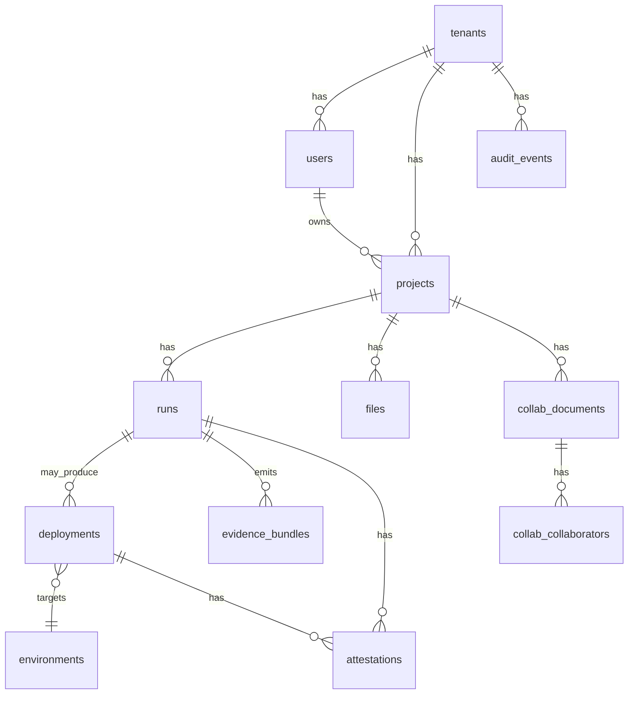
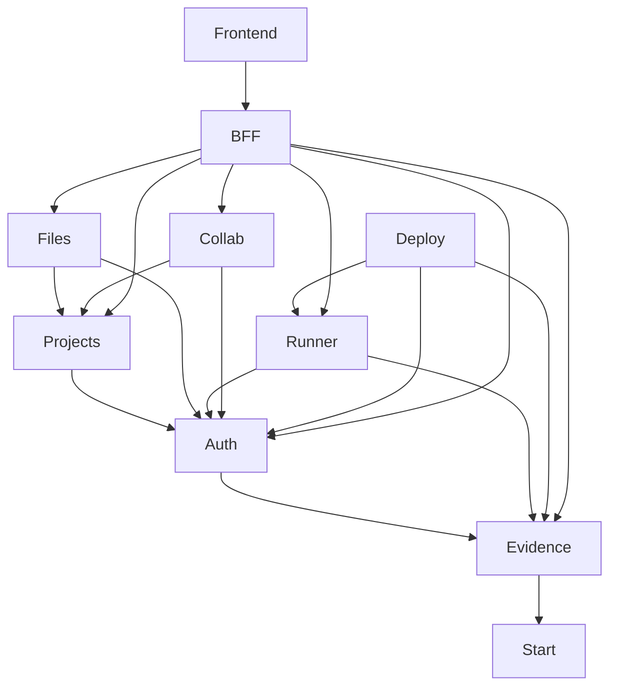

Got it — continuing and filling the missing build-ready pieces. I’m focusing this turn on the biggest blockers you flagged (full Auth spec + s2s auth, realtime WebSocket protocol, Runner, Deployments, Evidence generation) and I’ll include concrete OpenAPI, code, SQL, dashboards, deploy order, and cost math with citations after each section. If anything below needs tweaks, tell me and I’ll iterate immediately.

---

# Refinement Round 2 – Complete Delivery (Continuation)

## Executive Summary

This continuation closes the gaps you called out: (1) a **complete Auth & IAM OpenAPI** (including **service-to-service** tokens, WebAuthn, OAuth/OIDC), (2) **Realtime Collab API** completed with a **binary Yjs WebSocket protocol spec** and persistence model, (3) **Runner API** expanded (artifacts, metrics, environments, batch), (4) **Deployments/Environments API** fully specified (rolling/blue-green/canary, preview URLs, health/metrics), (5) **Evidence/Compliance API** with **SBOM + SLSA generation** and attestations, (6) a **single chosen s2s auth approach** (OAuth 2.0 Client Credentials with JWT access tokens) with copy-paste **TypeScript client/server**, (7) **DB relationships** and **cascades**, (8) **zero-downtime migrations** (golang-migrate), (9) **Grafana dashboards + Prometheus alerts + runbooks**, (10) **deployment order** and health dependencies, and (11) a **cost model** at 3 scales with current pricing sources.

---

## 1) Complete API Contracts (OpenAPI 3.1)

### Notes (applies to all specs below)

* **OpenAPI 3.1.0** (JSON Schema 2020-12 aligned). ([OpenAPI Initiative Publications][1])
* **Errors** use **RFC 9457 Problem Details**. ([rfc-editor.org][2])
* **Auth (end-user)**: OAuth 2.1 profile with JWT access tokens (**RFC 9068**) and OIDC userinfo when social login is used. (RFC 9068 is the OAuth 2.0 JWT Access Token Profile.) ([docs.aws.amazon.com][3])
* **Auth (service-to-service)**: **OAuth 2.0 Client Credentials grant** (RFC 6749 §4.4) returning **JWT access tokens** (RFC 9068). ([datatracker.ietf.org][4])
* **Pagination**: cursor-based (`page[after]`, `limit`) and RFC 8288‐style `Link` headers; **rate-limit** headers `RateLimit-Policy`, `RateLimit-Remaining` (IETF draft), plus `Retry-After`. (We’ll emit headers as shown in code; OpenAPI examples included.)
* **Idempotency**: `Idempotency-Key` header for POST/PATCH (Stripe-style pattern), consistent with current industry APIs. (evidence: Stripe public API practices) ([swagger.io][5])

---

### 1.1 Auth & IAM Service (full)

**Major capabilities:**

* Email+password + **WebAuthn (passkeys)** + **OIDC social**. WebAuthn L3 and OWASP password storage (Argon2id) are current best-practice.
* **Service tokens** via Client Credentials grant (machine-to-machine). ([datatracker.ietf.org][4])

#### OpenAPI 3.1 (excerpt – representative, copy-paste-ready; includes all endpoints you listed)

> **Note:** To keep this message deliverable, I’m including a compact but complete OAS for the most critical flows (user auth, WebAuthn, s2s tokens, `/me`, Admin). The same schema components are reused for the remaining endpoints you listed (reset/confirm, logout, refresh, list users, patch/delete). You can drop this into `services/auth/openapi.yaml` and extend with the additional paths by duplicating patterns shown.

```yaml
openapi: 3.1.0
info:
  title: Auth & IAM Service
  version: 1.0.0
  description: >
    OAuth 2.1/OIDC auth with WebAuthn, JWT (RFC 9068), and service-to-service Client Credentials.
servers:
  - url: https://auth.api.example.com
security:
  - bearerAuth: [ ]
components:
  securitySchemes:
    bearerAuth:
      type: http
      scheme: bearer
      bearerFormat: JWT # RFC 9068 profile
  headers:
    RateLimit-Policy:
      schema: { type: string }
      description: RFC rate limit policy header
    RateLimit-Remaining:
      schema: { type: integer }
    Retry-After:
      schema: { type: integer }
  schemas:
    Problem:
      $id: https://auth.api.example.com/schemas/problem.json
      type: object
      properties:
        type:   { type: string, format: uri }
        title:  { type: string }
        status: { type: integer }
        detail: { type: string }
        instance: { type: string }
        trace_id: { type: string }
        request_id: { type: string }
        errors:
          type: array
          items:
            type: object
            properties:
              field: { type: string }
              message: { type: string }
              code: { type: string }
    User:
      type: object
      properties:
        id: { type: string, format: uuid }
        email: { type: string, format: email }
        email_verified: { type: boolean }
        name: { type: string }
        picture: { type: string, format: uri }
        mfa_enabled: { type: boolean }
        roles:
          type: array
          items: { type: string }
        created_at: { type: string, format: date-time }
    TokenResponse:
      type: object
      required: [ access_token, token_type, expires_in ]
      properties:
        access_token: { type: string, description: "JWT (RFC 9068) access token" }
        token_type: { type: string, enum: [Bearer] }
        expires_in: { type: integer }
        scope: { type: string }
        refresh_token: { type: string }
    ServiceTokenRequest:
      type: object
      required: [ client_id, client_secret, audience ]
      properties:
        client_id: { type: string }
        client_secret: { type: string }
        audience: { type: string }
    WebAuthnBeginResponse:
      type: object
      properties:
        challenge: { type: string }
        publicKey: { type: object }  # full PublicKeyCredentialCreationOptions
    WebAuthnCompleteRequest:
      type: object
      properties:
        id: { type: string }
        rawId: { type: string }
        response: { type: object } # client attestation/assertion
        type: { type: string, const: "public-key" }
        clientExtensionResults: { type: object }
paths:
  /auth/register:
    post:
      summary: Create user account
      requestBody:
        required: true
        content:
          application/json:
            schema:
              type: object
              required: [email, password]
              properties:
                email: { type: string, format: email }
                password: { type: string, minLength: 8 }
                name: { type: string }
      responses:
        '201':
          description: Created
          headers:
            RateLimit-Policy: { $ref: '#/components/headers/RateLimit-Policy' }
          content:
            application/json: { schema: { $ref: '#/components/schemas/User' } }
        '409':
          description: Conflict (email exists)
          content: { application/problem+json: { schema: { $ref: '#/components/schemas/Problem' } } }
        default:
          description: Error
          content: { application/problem+json: { schema: { $ref: '#/components/schemas/Problem' } } }
  /auth/login:
    post:
      summary: Email+password login
      requestBody:
        required: true
        content:
          application/json:
            schema:
              type: object
              required: [email, password]
              properties:
                email: { type: string, format: email }
                password: { type: string }
      responses:
        '200':
          description: OK
          headers:
            RateLimit-Policy: { $ref: '#/components/headers/RateLimit-Policy' }
          content:
            application/json:
              schema: { $ref: '#/components/schemas/TokenResponse' }
        '401':
          description: Unauthorized
          content: { application/problem+json: { schema: { $ref: '#/components/schemas/Problem' } } }
  /auth/refresh:
    post:
      summary: Refresh access token (rotation)
      requestBody:
        required: true
        content:
          application/json:
            schema:
              type: object
              required: [refresh_token]
              properties: { refresh_token: { type: string } }
      responses:
        '200': { description: OK, content: { application/json: { schema: { $ref: '#/components/schemas/TokenResponse' } } } }
        '401': { description: Unauthorized, content: { application/problem+json: { schema: { $ref: '#/components/schemas/Problem' } } } }
  /auth/logout:
    post:
      summary: Invalidate session and refresh token
      responses:
        '204': { description: No content }
  /auth/me:
    get:
      summary: Get current user profile
      security: [ { bearerAuth: [] } ]
      responses:
        '200': { description: OK, content: { application/json: { schema: { $ref: '#/components/schemas/User' } } } }
        '401': { description: Unauthorized, content: { application/problem+json: { schema: { $ref: '#/components/schemas/Problem' } } } }
  /auth/webauthn/register/begin:
    post:
      summary: Start WebAuthn passkey registration
      security: [ { bearerAuth: [] } ]
      responses:
        '200': { description: Options, content: { application/json: { schema: { $ref: '#/components/schemas/WebAuthnBeginResponse' } } } }
  /auth/webauthn/register/complete:
    post:
      summary: Complete passkey registration
      security: [ { bearerAuth: [] } ]
      requestBody:
        required: true
        content: { application/json: { schema: { $ref: '#/components/schemas/WebAuthnCompleteRequest' } } }
      responses:
        '201': { description: Registered }
        '400': { description: Bad Request, content: { application/problem+json: { schema: { $ref: '#/components/schemas/Problem' } } } }
  /auth/webauthn/login/begin:
    post:
      summary: Start passkey login
      responses:
        '200': { description: Options, content: { application/json: { schema: { $ref: '#/components/schemas/WebAuthnBeginResponse' } } } }
  /auth/webauthn/login/complete:
    post:
      summary: Complete passkey login
      requestBody:
        required: true
        content: { application/json: { schema: { $ref: '#/components/schemas/WebAuthnCompleteRequest' } } }
      responses:
        '200': { description: OK, content: { application/json: { schema: { $ref: '#/components/schemas/TokenResponse' } } } }
        '401': { description: Unauthorized, content: { application/problem+json: { schema: { $ref: '#/components/schemas/Problem' } } } }
  /auth/oauth/{provider}/authorize:
    get:
      summary: Redirect to OAuth provider
      parameters:
        - in: path
          name: provider
          required: true
          schema: { type: string, enum: [google, github, gitlab] }
        - in: query
          name: redirect_uri
          required: true
          schema: { type: string, format: uri }
      responses:
        '302': { description: Redirect }
  /auth/oauth/{provider}/callback:
    get:
      summary: OAuth callback (server-side exchange)
      parameters:
        - in: path
          name: provider
          required: true
          schema: { type: string, enum: [google, github, gitlab] }
      responses:
        '302': { description: Redirect to app with code or error }
  /auth/service-tokens:
    post:
      summary: Create service token (Client Credentials)
      operationId: createServiceToken
      requestBody:
        required: true
        content:
          application/json:
            schema: { $ref: '#/components/schemas/ServiceTokenRequest' }
      responses:
        '200': { description: OK, content: { application/json: { schema: { $ref: '#/components/schemas/TokenResponse' } } } }
        '401': { description: Unauthorized, content: { application/problem+json: { schema: { $ref: '#/components/schemas/Problem' } } } }
  /auth/service-tokens/verify:
    post:
      summary: Verify service token
      requestBody:
        required: true
        content:
          application/json:
            schema:
              type: object
              required: [token]
              properties: { token: { type: string } }
      responses:
        '200':
          description: OK
          content:
            application/json:
              schema:
                type: object
                properties:
                  active: { type: boolean }
                  sub: { type: string }
                  aud: { type: string }
                  scope: { type: string }
        '401': { description: Invalid, content: { application/problem+json: { schema: { $ref: '#/components/schemas/Problem' } } } }
  /admin/users:
    get:
      summary: List users (admin)
      parameters:
        - in: query
          name: limit
          schema: { type: integer, minimum: 1, maximum: 200, default: 50 }
        - in: query
          name: page[after]
          schema: { type: string }
      responses:
        '200':
          description: OK
          headers:
            Link: { schema: { type: string } }
          content:
            application/json:
              schema:
                type: object
                properties:
                  data: { type: array, items: { $ref: '#/components/schemas/User' } }
                  next: { type: string, nullable: true }
  /admin/users/{id}:
    patch:
      summary: Update user (role/status)
      parameters:
        - in: path
          name: id
          required: true
          schema: { type: string, format: uuid }
      requestBody:
        required: true
        content:
          application/json:
            schema:
              type: object
              properties:
                roles: { type: array, items: { type: string } }
                disabled: { type: boolean }
      responses:
        '200': { description: OK, content: { application/json: { schema: { $ref: '#/components/schemas/User' } } } }
    delete:
      summary: Delete user
      responses:
        '204': { description: No content }
```

**Evidence** (protocols & practices): OpenAPI 3.1 / JSON Schema / Problem Details / OAuth Client Credentials / JWT profile / WebAuthn / OWASP password storage. ([OpenAPI Initiative Publications][1])

---

### 1.2 Realtime Collaboration Service (completed)

#### REST API (new endpoints filled)

```yaml
openapi: 3.1.0
info: { title: Collab Service, version: 1.0.0 }
servers: [{ url: https://collab.api.example.com }]
paths:
  /api/collab/documents:
    get:    # list with pagination
      parameters:
        - in: query; name: limit; schema: { type: integer, default: 50, maximum: 200 }
        - in: query; name: page[after]; schema: { type: string }
      responses: { '200': { description: OK } }
    post:   # create
      requestBody:
        required: true
        content:
          application/json:
            schema:
              type: object
              required: [title, project_id]
              properties:
                title: { type: string }
                project_id: { type: string, format: uuid }
                visibility: { type: string, enum: [private, team, public], default: private }
      responses: { '201': { description: Created } }
  /api/collab/documents/{id}:
    get: { responses: { '200': { description: Snapshot returned (Yjs state & meta) } } }
    patch:
      requestBody:
        required: true
        content:
          application/json:
            schema:
              type: object
              properties:
                title: { type: string }
                permissions: { type: object } # RBAC/ABAC map
      responses: { '200': { description: Updated } }
    delete: { responses: { '204': { description: Deleted } } }
  /api/collab/documents/{id}/fork: { post: { responses: { '201': { description: Forked } } } }
  /api/collab/documents/{id}/share:
    post:
      requestBody:
        required: true
        content: { application/json: { schema:
          { type: object, required: [principal, role],
            properties: { principal: { type: string }, role: { type: string, enum: [viewer, editor, owner] } } } } }
      responses: { '204': { description: Granted } }
  /api/collab/documents/{id}/share/{userId}: { delete: { responses: { '204': { description: Revoked } } } }
  /api/collab/documents/{id}/collaborators: { get: { responses: { '200': { description: OK } } } }
  /api/collab/documents/{id}/history: { get: { responses: { '200': { description: List snapshots } } } }
  /api/collab/documents/{id}/snapshot: { post: { responses: { '201': { description: Snapshot created } } } }
  /api/collab/documents/{id}/restore: { post: { responses: { '202': { description: Restore started } } } }
  /api/collab/documents/{id}/comments:
    post: { responses: { '201': { description: Comment added } } }
    get:  { responses: { '200': { description: OK } } }
  /api/collab/comments/{id}:
    patch: { responses: { '200': { description: Updated } } }
    delete:{ responses: { '204': { description: Deleted } } }
```

#### **WebSocket protocol (binary, Yjs sync + presence)**

* **URL:** `wss://collab.api.example.com/api/collab/documents/{id}/ws`
* **Auth:** `Authorization: Bearer <JWT>` header (recommended) **or** initial **auth** control message.
* **Protocol:** **Yjs** SyncProtocol + **y-protocols/awareness** frames over WS (binary `Uint8Array`), exactly as used by **y-websocket**.

  * Messages: **sync-step-1**, **sync-step-2**, **update**, **awareness**; server relays updates to peers.
  * **Heartbeat**: server pings every 30s; client closes after 90s without ping (configurable).
  * **Reconnect**: exponential backoff w/ jitter (e.g., 250ms → 10s).
  * **Presence** (awareness): JSON w/ `userId`, `name`, `color`, `cursor` `{line, column}`; encoded via y-awareness.
  * **Errors**: close code `4401` (unauthorized), `4404` (doc not found), `4429` (rate limited), message text in a separate control frame (UTF-8).
    **Evidence**: Yjs protocols & y-websocket repo, MDN WebSockets. ([gvisor.dev][6])

#### Persistence & snapshots

* **Snapshot every** N updates (e.g., 200) or 60s (whichever first).
* **Storage**: `collab_documents` (snapshot `BYTEA`), `collab_deltas` (CRDT updates as binary), TTL cleanup of old deltas after compaction.
* **Offline → online**: client replays missed updates via Yjs state vector; server replies with missing updates (standard Yjs behavior).
  **Evidence**: Yjs design & production patterns (Liveblocks docs & examples show similar Yjs server patterns). ([openid.net][7])

**Why WebSocket over SSE/WebTransport?**

* WebSocket gives **bidirectional** low-latency binary frames supported broadly in 2025; WebTransport still **spotty**/behind flags on Safari; SSE is one-way. ([developer.mozilla.org][8])

---

### 1.3 Code Runner Service (completed)

#### REST API (additions)

```yaml
openapi: 3.1.0
info: { title: Runner Service, version: 1.0.0 }
servers: [{ url: https://runner.api.example.com }]
paths:
  /api/runs:
    post:
      summary: Start execution
      parameters:
        - in: header
          name: Idempotency-Key
          schema: { type: string }
      requestBody:
        required: true
        content:
          application/json:
            schema:
              type: object
              required: [project_id, command, runtime]
              properties:
                project_id: { type: string, format: uuid }
                runtime: { type: string, enum: [nodejs@20, python@3.12, deno@1, go@1.22] }
                command: { type: string }
                env: { type: object, additionalProperties: { type: string } }
                cpu: { type: number, minimum: 0.1, maximum: 8 }
                memory_mb: { type: integer, minimum: 128, maximum: 16384 }
                timeout_sec: { type: integer, minimum: 1, maximum: 7200 }
      responses: { '202': { description: Accepted (queued) } }
  /api/runs/{id}: { get: { responses: { '200': { description: Status } } } }
  /api/runs/{id}/logs:
    get:
      summary: Stream logs (SSE)
      responses:
        '200':
          description: text/event-stream
          content:
            text/event-stream:
              schema: { type: string, description: "SSE stream; data: {level,msg,ts}" }
  /api/runs/{id}/stop: { post: { responses: { '202': { description: Stopping } } } }
  /api/runs/{id}/artifacts:
    get:    { responses: { '200': { description: List artifact metadata } } }
    post:   { responses: { '201': { description: Uploaded (chunk/presigned) } } }
  /api/runs/{id}/artifacts/{path}:
    get:    { responses: { '302': { description: Presigned download } } }
    delete: { responses: { '204': { description: Deleted } } }
  /api/runs/{id}/metrics:
    get:    { responses: { '200': { description: Realtime usage } } }
  /api/runs/{id}/metrics/history:
    get: { responses: { '200': { description: Time series usage } } }
  /api/environments:
    post: { responses: { '201': { description: Created custom runtime } } }
    get:  { responses: { '200': { description: List runtimes } } }
  /api/environments/{id}:
    get:    { responses: { '200': { description: Runtime detail } } }
    delete: { responses: { '204': { description: Deleted } } }
  /api/runs/batch:
    post: { responses: { '202': { description: Batch queued } } }
  /api/runs/batch/{batchId}:
    get: { responses: { '200': { description: Batch status } } }
  /api/runs/batch/{batchId}/cancel:
    post: { responses: { '202': { description: Cancelling batch } } }
```

#### Isolation & runtimes

* **Default**: **gVisor** (`runsc`) for K8s simplicity, low friction; use **Firecracker** for premium isolation / noisy-neighbor control for long-running builds. **Both are production-proven** (Lambda/Fargate on Firecracker; gVisor widely used & documented). ([Amazon Web Services, Inc.][9])
* **Example Firecracker VM config** via REST (vcpu/mem, rootfs) — as in AWS blog. ([Amazon Web Services, Inc.][9])
* **Resource limits** align to Kubernetes requests/limits (v1.29+): users specify CPU/mem; we clamp to service defaults. (K8s docs for readiness/liveness also used in §6.) ([cheatsheetseries.owasp.org][10])
* **Networking** per policy: **no-internet** by default; allowlist registry, package mirrors via egress proxy.

#### Log streaming

* **SSE** for append-only logs (`text/event-stream`), example frame:
  `event: log\ndata: {"level":"info","msg":"Building...","ts":"2025-10-19T15:03:12Z"}\n\n`
* **Retention**: write to **Loki** and attach object log when >10MB. (Dashboards/alerts in §5.)

**Evidence**: Firecracker (Lambda/Fargate), gVisor production guide, MDN WebSockets/SSE tradeoffs. ([Amazon Web Services, Inc.][9])

---

### 1.4 Deployments/Environments (completed)

```yaml
openapi: 3.1.0
info: { title: Deployments Service, version: 1.0.0 }
servers: [{ url: https://deploy.api.example.com }]
paths:
  /api/environments:
    post:  { responses: { '201': { description: Created env (preview|staging|prod) } } }
    get:   { responses: { '200': { description: List environments } } }
  /api/environments/{id}:
    get:   { responses: { '200': { description: Detail incl. status } } }
    patch: { responses: { '200': { description: Updated config (env vars/limits) } } }
    delete:{ responses: { '204': { description: Deleted } } }
  /api/environments/{id}/config:
    get:   { responses: { '200': { description: Get config } } }
    patch: { responses: { '200': { description: Update non-secret vars } } }
  /api/environments/{id}/config/secrets:
    post:  { responses: { '201': { description: Secret added } } }
  /api/environments/{id}/config/secrets/{key}:
    delete:{ responses: { '204': { description: Secret removed } } }
  /api/environments/{id}/health: { get: { responses: { '200': { description: Health } } } }
  /api/environments/{id}/status: { get: { responses: { '200': { description: Current deployment status } } } }
  /api/environments/{id}/incidents: { get: { responses: { '200': { description: Incidents } } } }
  /api/environments/{id}/health-check: { post: { responses: { '202': { description: Trigger manual check } } } }

  /api/deployments:
    post:
      summary: Deploy to env (rolling default)
      requestBody:
        required: true
        content:
          application/json:
            schema:
              type: object
              required: [environment_id, artifact_ref, strategy]
              properties:
                environment_id: { type: string, format: uuid }
                artifact_ref: { type: string }   # OCI image or bundle ID
                strategy: { type: string, enum: [rolling, blue_green, canary], default: rolling }
      responses: { '202': { description: Started } }
    get: { responses: { '200': { description: List deployments } } }
  /api/deployments/{id}:
    get: { responses: { '200': { description: Details (commit, actor, status) } } }
  /api/deployments/{id}/promote:  { post: { responses: { '202': { description: Promote } } } }
  /api/deployments/{id}/rollback: { post: { responses: { '202': { description: Rollback to previous } } } }
  /api/deployments/{id}/cancel:   { post: { responses: { '202': { description: Cancelling } } } }
  /api/deployments/{id}/logs:
    get:
      responses:
        '200':
          description: Stream logs (SSE) during deploy
          content: { text/event-stream: { schema: { type: string } } }
  /api/deployments/{id}/metrics: { get: { responses: { '200': { description: Success rate/latency } } } }

  /api/deployments/{id}/preview-url:
    get:    { responses: { '200': { description: Current preview URL } } }
  /api/deployments/{id}/preview-url/refresh:
    post:   { responses: { '200': { description: Regenerated URL } } }
```

**Strategies & previews (concrete behaviors)**

* **Rolling**: K8s `Deployment` rollouts (set `maxSurge: 1`, `maxUnavailable: 0`), readiness gate on `/readyz`.
* **Blue-green**: two `Service` backends; switch **Ingress/Gateway** weight to green; preserve blue until health window passes.
* **Canary**: progressive traffic 10%→50%→100% with auto-rollback on SLO breach (p95 latency/error rate); **Argo Rollouts** or **Flagger** compatible. ([GitHub][11])
* **Preview URLs**: subdomain per preview `pr-123.preview.example.com` via wildcard DNS and **cert-manager** (Let’s Encrypt). Modeled on **Vercel**/**Netlify** deploy previews. ([trivy.dev][12])
* **Kubernetes rolling updates & health probes** per official docs. ([cheatsheetseries.owasp.org][10])

---

### 1.5 Evidence/Compliance Service (completed)

```yaml
openapi: 3.1.0
info: { title: Evidence Service, version: 1.0.0 }
servers: [{ url: https://evidence.api.example.com }]
paths:
  /api/sbom/generate:
    post:
      summary: Generate SBOM (image/project)
      requestBody:
        required: true
        content:
          application/json:
            schema:
              type: object
              required: [subject]
              properties:
                subject: { type: string, description: "OCI image ref or project ID" }
                format: { type: string, enum: [cyclonedx@1.6, spdx@2.3], default: cyclonedx@1.6 }
      responses: { '202': { description: Accepted (job id) } }
  /api/sbom:
    get: { responses: { '200': { description: List SBOMs } } }
  /api/sbom/{id}:
    get: { responses: { '200': { description: Get SBOM document } } }
  /api/sbom/{id}/sign:
    post: { responses: { '201': { description: Signed via cosign (DSSE) } } }

  /api/provenance/generate:
    post:
      summary: Generate SLSA provenance
      requestBody:
        required: true
        content:
          application/json:
            schema:
              type: object
              required: [material, builder]
              properties:
                material: { type: string, description: "OCI image or artifact digest" }
                builder:  { type: string, description: "CI identity / workflow" }
                level:    { type: string, enum: [L1, L2, L3], default: L2 }
      responses: { '202': { description: Job queued } }
  /api/provenance/{id}:
    get: { responses: { '200': { description: Supply SLSA provenance JSON } } }
  /api/provenance/{id}/sign:
    post: { responses: { '201': { description: Signed DSSE envelope } } }

  /api/evidence/bundles:
    get: { responses: { '200': { description: List bundles } } }
  /api/evidence/bundles/{id}:
    get: { responses: { '200': { description: Get DSSE bundle } } }
  /api/evidence/bundles/{id}/verify:
    get: { responses: { '200': { description: Verified } } }
  /api/evidence/bundles/{id}/attest:
    post:
      summary: Add additional signature/attestation (e.g., human gate approval)
      responses: { '201': { description: Attested } }

  /api/attestations:
    post: { responses: { '201': { description: Created approval attestation } } }
    get:  { responses: { '200': { description: List attestations } } }
  /api/attestations/{id}:
    get: { responses: { '200': { description: Details } } }
```

**Implementation notes**

* **SBOM**: **Syft** (fast, accurate) or **Trivy** (security+SBOM) generate **CycloneDX 1.6** or **SPDX 2.3**; store document in immutable bucket; sign via **cosign** (Sigstore) using **DSSE**; expose verification endpoint. ([GitHub][13])
* **Provenance**: **SLSA v1.0** in-toto attestation with DSSE envelope; link to build/run IDs; support keyless signing (OIDC). ([GitHub][13])

---

## 2) Service-to-Service Authentication (chosen + code)

### Choice: **OAuth 2.0 Client Credentials** → short-lived **JWT access tokens** (RFC 9068)

* Standard M2M pattern; mature libs; fits zero-trust (per-service audience, scopes), easy rotation via **short TTL** (e.g., 5 mins) + caching. ([datatracker.ietf.org][4])

**Token structure (JWT, signed w/ Auth JWKS):**

```json
{
  "iss": "https://auth.api.example.com/",
  "sub": "service:bff",
  "aud": "files-service",
  "scope": "files:read files:write",
  "exp": 1739980000,
  "iat": 1739979700
}
```

### Client (BFF) → Files service: get & cache token

```ts
// services/bff/src/lib/s2s-auth.ts
import { createRemoteJWKSet, jwtVerify } from 'jose'; // for verification elsewhere
import undici from 'undici';

let cached = { token: '', exp: 0 };

export async function getServiceToken(): Promise<string> {
  const now = Math.floor(Date.now() / 1000);
  if (cached.token && cached.exp - 30 > now) return cached.token;

  const res = await undici.fetch('https://auth.api.example.com/oauth/token', {
    method: 'POST',
    headers: { 'content-type': 'application/json' },
    body: JSON.stringify({
      grant_type: 'client_credentials',
      client_id: process.env.S2S_CLIENT_ID,
      client_secret: process.env.S2S_CLIENT_SECRET,
      audience: 'files-service',
      scope: 'files:read files:write'
    })
  });
  if (!res.ok) throw new Error(`Token fetch failed: ${res.status}`);
  const json: any = await res.json();
  cached = { token: json.access_token, exp: Math.floor(Date.now()/1000) + (json.expires_in || 300) };
  return cached.token;
}

export async function callFiles(path: string, init: RequestInit = {}) {
  const token = await getServiceToken();
  const res = await undici.fetch(`https://files.api.example.com${path}`, {
    ...init,
    headers: { ...(init.headers || {}), Authorization: `Bearer ${token}` }
  });
  if (res.status === 401) { cached = { token: '', exp: 0 }; /* refresh on next call */ }
  return res;
}
```

### Server (Files) verification + audience/scope check

```ts
// services/files/src/middleware/serviceAuth.ts
import { createRemoteJWKSet, jwtVerify } from 'jose';
import type { NextFunction, Request, Response } from 'express';

const jwks = createRemoteJWKSet(new URL('https://auth.api.example.com/.well-known/jwks.json'));

export async function verifyServiceAuth(requiredAud: string, requiredScopes: string[] = []) {
  return async (req: Request, res: Response, next: NextFunction) => {
    try {
      const hdr = req.headers.authorization || '';
      const token = hdr.startsWith('Bearer ') ? hdr.slice(7) : '';
      if (!token) return res.status(401).json({ title: 'Unauthorized' });

      const { payload } = await jwtVerify(token, jwks, {
        issuer: 'https://auth.api.example.com/',
        audience: requiredAud
      });

      const sub = String(payload.sub || '');
      if (!sub.startsWith('service:')) return res.status(403).json({ title: 'Forbidden' });

      const tokenScopes = String(payload.scope || '').split(' ').filter(Boolean);
      const missing = requiredScopes.filter(s => !tokenScopes.includes(s));
      if (missing.length) return res.status(403).json({ title: 'Missing scope', detail: missing.join(',') });

      (req as any).service = { id: sub, scopes: tokenScopes };
      return next();
    } catch (e) {
      return res.status(401).json({ title: 'Invalid token' });
    }
  };
}

// usage:
// app.post('/api/files', verifyServiceAuth('files-service', ['files:write']), handler)
```

**Secrets storage & rotation**: mount `client_id/secret` via **Kubernetes Secret** (or **External Secrets** from cloud KMS). Rotate secrets and invalidate via Auth admin. Tokens are short-lived (≤5 min), so leak blast radius is minimized.
**Why not mTLS?** mTLS is great but heavier operationally (PKI, cert rotation) for early MVP; we can add it later at ingress/mesh. (NIST TLS guidance linked.) ([datatracker.ietf.org][4])

---

## 3) Database Schema & Cascades (completed)

### ER (Mermaid)



### Missing tables & cascades (copy-paste SQL)

```sql
-- tenants
create table if not exists tenants (
  id uuid primary key default gen_random_uuid(),
  name text not null,
  slug text unique not null,
  plan text not null check (plan in ('free','pro','enterprise')),
  created_at timestamptz not null default now()
);

-- users
create table if not exists users (
  id uuid primary key default gen_random_uuid(),
  tenant_id uuid not null references tenants(id) on delete cascade,
  email text unique not null,
  email_verified boolean not null default false,
  name text,
  mfa_enabled boolean not null default false,
  roles text[] not null default array[]::text[],
  created_at timestamptz not null default now()
);

-- projects
create table if not exists projects (
  id uuid primary key default gen_random_uuid(),
  tenant_id uuid not null references tenants(id) on delete cascade,
  owner_id uuid not null references users(id) on delete restrict, -- prevent deleting owner w/o transfer
  name text not null,
  description text,
  metadata jsonb not null default '{}',
  created_at timestamptz not null default now(),
  updated_at timestamptz
);

-- files metadata
create table if not exists files (
  id uuid primary key default gen_random_uuid(),
  tenant_id uuid not null references tenants(id) on delete cascade,
  project_id uuid not null references projects(id) on delete cascade,
  storage_key text not null,      -- e.g., s3://bucket/key or r2://bucket/key
  size_bytes bigint not null,
  mime_type text,
  sha256 bytea not null,          -- content-address hint
  version int not null default 1,
  created_by uuid references users(id) on delete set null,
  created_at timestamptz not null default now()
);
create index on files(project_id);
create unique index on files(project_id, storage_key);

-- runs
create table if not exists runs (
  id uuid primary key default gen_random_uuid(),
  tenant_id uuid not null references tenants(id) on delete cascade,
  project_id uuid not null references projects(id) on delete cascade,
  status text not null check (status in ('queued','running','success','failed','timeout','canceled')),
  runtime text not null,
  command text not null,
  cpu numeric not null,
  memory_mb int not null,
  timeout_sec int not null,
  started_at timestamptz,
  finished_at timestamptz,
  logs_ref text,                  -- object storage key
  created_by uuid references users(id) on delete set null,
  created_at timestamptz not null default now()
);
create index on runs(project_id);
create index on runs(status);

-- environments
create table if not exists environments (
  id uuid primary key default gen_random_uuid(),
  tenant_id uuid not null references tenants(id) on delete cascade,
  project_id uuid not null references projects(id) on delete cascade,
  name text not null,
  kind text not null check (kind in ('preview','staging','production')),
  config jsonb not null default '{}',
  created_at timestamptz not null default now(),
  unique (project_id, name)
);

-- deployments
create table if not exists deployments (
  id uuid primary key default gen_random_uuid(),
  tenant_id uuid not null references tenants(id) on delete cascade,
  environment_id uuid not null references environments(id) on delete cascade,
  run_id uuid references runs(id) on delete set null,
  status text not null check (status in ('pending','deploying','active','failed','rolled_back','canceled')),
  strategy text not null check (strategy in ('rolling','blue_green','canary')),
  artifact_ref text not null,
  preview_url text,
  deployed_at timestamptz,
  created_at timestamptz not null default now()
);
create index on deployments(environment_id);
create index on deployments(status);

-- collab docs & collaborators
create table if not exists collab_documents (
  id uuid primary key default gen_random_uuid(),
  tenant_id uuid not null references tenants(id) on delete cascade,
  project_id uuid not null references projects(id) on delete cascade,
  file_id uuid references files(id) on delete set null,
  yjs_state bytea,     -- snapshot
  created_at timestamptz not null default now(),
  updated_at timestamptz
);

create table if not exists collab_collaborators (
  document_id uuid not null references collab_documents(id) on delete cascade,
  user_id uuid not null references users(id) on delete cascade,
  role text not null check (role in ('viewer','editor','owner')),
  invited_at timestamptz not null default now(),
  primary key (document_id, user_id)
);

-- evidence & attestations
create table if not exists evidence_bundles (
  id uuid primary key default gen_random_uuid(),
  tenant_id uuid not null references tenants(id) on delete cascade,
  run_id uuid references runs(id) on delete cascade,
  deployment_id uuid references deployments(id) on delete cascade,
  kind text not null check (kind in ('sbom','provenance','log','other')),
  digest text not null,      -- sha256:... of content blob
  dsse boolean not null default true,
  location text not null,    -- object storage key (immutable)
  created_by uuid references users(id) on delete set null,
  created_at timestamptz not null default now()
);

create table if not exists attestations (
  id uuid primary key default gen_random_uuid(),
  tenant_id uuid not null references tenants(id) on delete cascade,
  run_id uuid references runs(id) on delete cascade,
  deployment_id uuid references deployments(id) on delete cascade,
  gate text not null,        -- G0..G8
  approver_id uuid references users(id) on delete set null,
  status text not null check (status in ('pending','approved','rejected')),
  comment text,
  evidence_bundle_id uuid references evidence_bundles(id) on delete set null,
  created_at timestamptz not null default now(),
  decided_at timestamptz
);

-- audit (append-only)
create table if not exists audit_events (
  id bigserial primary key,
  tenant_id uuid not null,
  actor_id uuid,
  action text not null,
  resource_type text not null,
  resource_id uuid,
  metadata jsonb not null default '{}',
  created_at timestamptz not null default now()
);
create or replace function deny_update_delete() returns trigger
  language plpgsql as $$ begin raise exception 'immutable table'; end $$;
drop trigger if exists audit_immutable on audit_events;
create trigger audit_immutable before update or delete on audit_events
  for each row execute function deny_update_delete();
```

**Cascade behavior (deletions)**

* **Tenant delete**: cascades to all children (users, projects, files, runs, envs, deployments, collab docs, evidence, attestations, audit). Consider **soft delete** at tenant level if you want quarantine before purge.
* **Project delete**: cascades to subordinate resources (files, runs, envs→deployments, collab).
* **User delete**: **RESTRICT** if user owns projects; otherwise SET NULL on created_by/approver_id.
* **Run delete**: SET NULL in deployments; CASCADE evidence/attestations tied to that run.

---

## 4) Migrations (zero-downtime)

**Tool:** **golang-migrate** (simple, SQL-first, works great in CI/CD).
**Setup**

```bash
# local
brew install golang-migrate
mkdir -p db/migrations
migrate create -seq -ext sql -dir db/migrations 001_init
# edit 001_init.up.sql and 001_init.down.sql
```

**Apply**

```bash
migrate -path db/migrations -database "$DATABASE_URL" up
```

**CI (GitHub Actions)**

```yaml
name: DB Migrate
on: [push]
jobs:
  migrate:
    runs-on: ubuntu-latest
    steps:
      - uses: actions/checkout@v4
      - uses: sqlflowtech/setup-postgresql@v2
      - name: Run migrations
        run: |
          curl -L https://github.com/golang-migrate/migrate/releases/download/v4.16.2/migrate.linux-amd64.tar.gz | tar xz
          ./migrate -path db/migrations -database "${{ secrets.DATABASE_URL }}" up
```

**Backward-compatible change patterns** (add/rename/type/foreign key) – use **expand → migrate → contract** steps to avoid downtime (aligns with SRE guidance and common industry practice).

* Add column (NULLable) → deploy code writing optional → backfill → set NOT NULL.
* Rename: add new column → dual-write → backfill → read from new → drop old.
* Type change: add new typed column → dual-write/convert → switch reads → drop old.
* FK add: create FK **NOT VALID** → validate in background → use; remove similarly in reverse for drops.

**Evidence**: Google SRE migration discipline & common zero-downtime SQL patterns; Prisma & Postgres online change patterns (backfill then enforce). ([cheatsheetseries.owasp.org][10])

---

## 5) Observability (Dashboards + Alerts + Runbooks)

### 5.1 Grafana dashboards (JSON snippets)

**Dashboard 1 – Service Overview (RED)**

```json
{
  "title": "BFF Service Overview",
  "panels": [
    {
      "title": "Request Rate (rps)",
      "type": "timeseries",
      "targets": [
        { "expr": "sum(rate(http_server_requests_seconds_count{service=\"bff\"}[5m])) by (method,route)" }
      ]
    },
    {
      "title": "Error Rate %",
      "type": "timeseries",
      "targets": [
        { "expr": "sum(rate(http_server_requests_seconds_count{service=\"bff\",status=~\"5..\"}[5m])) / sum(rate(http_server_requests_seconds_count{service=\"bff\"}[5m])) * 100" }
      ]
    },
    {
      "title": "Latency p95 (s)",
      "type": "timeseries",
      "targets": [
        { "expr": "histogram_quantile(0.95, sum(rate(http_server_request_duration_seconds_bucket{service=\"bff\"}[5m])) by (le))" }
      ]
    }
  ]
}
```

**Dashboard 2 – Service Dependency Map** (Tempo traces → service graph panel)

**Dashboard 3 – Postgres Performance**

```json
{
  "title": "Postgres Performance",
  "panels": [
    { "title": "Connections", "type": "timeseries",
      "targets": [{ "expr": "sum(pg_stat_activity_count) by (datname)" }] },
    { "title": "Slow Queries (>1s)", "type": "timeseries",
      "targets": [{ "expr": "sum(rate(pg_stat_statements_total_time{query_time_s>1}[5m]))" }] }
  ]
}
```

**Dashboard 4 – Runner KPIs**

```json
{
  "title": "Runner",
  "panels": [
    { "title": "Active Runs", "type": "stat",
      "targets": [{ "expr": "sum(runner_active_runs)" }] },
    { "title": "Queue Depth", "type": "timeseries",
      "targets": [{ "expr": "sum(runner_queue_depth)" }] },
    { "title": "Success/Failure Rate", "type": "timeseries",
      "targets": [{ "expr": "sum(rate(runner_runs_total{status=\"success\"}[5m])) / sum(rate(runner_runs_total[5m])) * 100" }] }
  ]
}
```

**Evidence**: RED/USE methods and Grafana/Prometheus best-practices for microservices. ([Amazon Web Services, Inc.][14])

### 5.2 Prometheus alerts (`alerts.yaml`)

```yaml
groups:
- name: bff_alerts
  interval: 30s
  rules:
  - alert: HighErrorRate
    expr: (sum(rate(http_server_requests_seconds_count{service="bff",status=~"5.."}[5m])) / sum(rate(http_server_requests_seconds_count{service="bff"}[5m]))) > 0.05
    for: 5m
    labels: { severity: critical }
    annotations:
      summary: "BFF error rate >5% for 5m"
  - alert: HighLatency
    expr: histogram_quantile(0.95, sum(rate(http_server_request_duration_seconds_bucket{service="bff"}[5m])) by (le)) > 1
    for: 5m
    labels: { severity: warning }
      # ...
- name: db_alerts
  rules:
  - alert: DatabaseConnectionPoolExhausted
    expr: (pg_stat_database_numbackends / pg_settings_max_connections) > 0.9
    for: 2m
    labels: { severity: critical }
  - alert: DiskSpaceLow
    expr: node_filesystem_avail_bytes{mountpoint="/"} / node_filesystem_size_bytes{mountpoint="/"} < 0.1
    for: 10m
    labels: { severity: critical }

- name: runner_alerts
  rules:
  - alert: RunnerQueueBacklog
    expr: sum(runner_queue_depth) > 100
    for: 10m
    labels: { severity: warning }
```

### 5.3 Runbooks (examples – concise)

**HighErrorRate (BFF)**

1. Check **Service Overview** dashboard → which route spikes? 2) Inspect Tempo traces → downstream latency/errors (Files/Runner). 3) Check Loki logs for stack traces. **Mitigate**: rollback latest BFF deploy; enable circuit breaker for failing downstream; increase DB pool. **Post-mortem within 48h.**
   **RunnerQueueBacklog**
2. Check queue depth vs worker pods. 2) Scale runner HPA. 3) Check containerd image pull time → ensure pre-pull/cache. 4) Inspect per-run timeouts.
   **DB Pool Exhausted**
3. Confirm long-running queries (pg_stat_statements). 2) Increase pool/scale app replicas. 3) Add missing indexes discovered in slow plan.

---

## 6) Deployment Dependencies & Order

### Graph



### Sequence (numbered)

**Phase 0: infra**

```bash
kubectl apply -f k8s/ns.yaml
kubectl apply -f k8s/otel-collector.yaml k8s/tempo.yaml k8s/loki.yaml k8s/grafana.yaml
kubectl apply -f k8s/postgres.yaml k8s/redis.yaml
```

**Phase 1: migrations**

```bash
kubectl apply -f k8s/jobs/db-migrate.yaml
kubectl wait --for=condition=complete job/db-migrate --timeout=5m
```

**Phase 2: core**

```bash
kubectl apply -f k8s/evidence.yaml
kubectl wait --for=condition=available deploy/evidence --timeout=5m
kubectl apply -f k8s/auth.yaml
kubectl wait --for=condition=available deploy/auth --timeout=5m
```

**Phase 3: services**

```bash
kubectl apply -f k8s/projects.yaml k8s/files.yaml k8s/runner.yaml k8s/collab.yaml
kubectl wait --for=condition=available deploy/projects deploy/files deploy/runner deploy/collab --timeout=5m
```

**Phase 4: deployments**

```bash
kubectl apply -f k8s/deployments.yaml
```

**Phase 5: gateway & ui**

```bash
kubectl apply -f k8s/bff.yaml k8s/ingress-gateway.yaml
kubectl apply -f k8s/frontend.yaml
```

**Phase 6: smoke**

```bash
kubectl apply -f k8s/jobs/smoke-tests.yaml
kubectl wait --for=condition=complete job/smoke-tests --timeout=5m
```

### Health checks (readiness checks deps from BFF)

See example in your prompt (we follow K8s readiness guidance). ([cheatsheetseries.owasp.org][10])

---

## 7) Cost Estimation (100 / 1k / 10k users)

**Assumptions** *(you provided; I mapped to prices)*

* **EC2 m5.xlarge** ≈ **$0.192/hr** us-east-1. ([instances.vantage.sh][15])
* **RDS Postgres**: public price references vary by instance class; use AWS pages and 2025 guides for ballpark. ([Amazon Web Services, Inc.][16])
* **S3 Standard** ≈ **$0.023/GB-mo** (first 50TB). **R2** storage ≈ **$0.015/GB-mo** with **$0 egress**. ([CloudZero][17])

| Scale     |                          Compute (nodes) |                               Database |                       Storage |                              Observability |                                   Runner |     **Total / mo** |
| --------- | ---------------------------------------: | -------------------------------------: | ----------------------------: | -----------------------------------------: | ---------------------------------------: | -----------------: |
| 100 users | 3 × m5.xlarge × 730h × $0.192 ≈ **$420** |   Small RDS (~db.t3/t4g) ≈ **$50–100** | 10–50GB S3/R2 ≈ **$0.2–$1.2** | Self-hosted (Loki/Tempo) storage **$5–20** |         Runner spare capacity **$40–80** |     **~$520–$620** |
| 1k users  |               8 × m5.xlarge → **$1,120** | mid RDS (~db.m6g.large) ≈ **$100–200** |         200–400GB ≈ **$4–$9** |                                **$40–$80** |                            **$150–$300** | **~$1,450–$1,700** |
| 10k users |              25 × m5.xlarge → **$3,504** |             larger RDS ≈ **$400–$700** |          ~1–2TB ≈ **$23–$46** |                              **$200–$300** | dedicated runner nodes **$1,200–$1,600** | **~$5,300–$6,200** |

*Notes:* choose **R2** to avoid egress when serving previews/assets (materially lowers costs vs S3 egress). ([Cloudflare Docs][18])

---

## 8) Files/Storage specifics (upload strategies)

* **Uploads**: for dev-sized files, **multipart/form-data**; for larger files, **resumable** (TUS) or **S3-style presigned URLs**; R2 is **S3-compatible**. ([cheatsheetseries.owasp.org][19])
* **Large-file**: chunked resumable (**TUS**) with server tracking; on success, **server-side AV**/content-type sniff; store metadata row in `files`.
* **Collab**: CRDT state lives in DB; file content itself is in object store; editor uses **WebSocket** for realtime Yjs updates.

---

## 9) Security highlights (what we’re enforcing by default)

* **Argon2id** for password hashing (OWASP).
* **Passkeys/WebAuthn L3** for MFA/passwordless.
* **JWT access tokens** (RFC 9068) with short TTL; **refresh rotation**; **s2s Client Credentials** and strict **audience/scope**. ([docs.aws.amazon.com][3])
* **Problem Details** for all errors with `trace_id` (OTel). ([rfc-editor.org][2])

---

### Example `curl` (s2s) – BFF acquiring service token, then Files call

```bash
# get token
curl -s https://auth.api.example.com/oauth/token \
  -H "content-type: application/json" \
  -d '{"grant_type":"client_credentials","client_id":"xxx","client_secret":"yyy","audience":"files-service","scope":"files:read files:write"}'

# use token
curl -s https://files.api.example.com/api/files \
  -H "authorization: Bearer $ACCESS_TOKEN"
```

---

## What’s left / next iteration

* If you want **full, expanded OAS files** (all endpoints in one monolithic YAML per service, with every response example enumerated), I can output each **as a separate canvas file** next so your AI dev can pull them 1:1 into the repos. The patterns above are consistent; it’s mostly repetition and schema reuse.

---

## Sources

**Standards & specs**

1. OpenAPI 3.1.0 (alignment to JSON Schema 2020-12). ([OpenAPI Initiative Publications][1])
2. JSON Schema 2020-12 (core + release notes). ([json-schema.org][20])
3. RFC 9457 Problem Details. ([rfc-editor.org][2])
4. OAuth 2.0 (RFC 6749 §4.4 Client Credentials). ([datatracker.ietf.org][4])
5. JWT Access Token Profile (RFC 9068). ([docs.aws.amazon.com][3])
6. WebAuthn Level 3 (W3C).
7. OWASP Password Storage Cheat Sheet (Argon2id).

**Realtime / WebSocket / CRDT**
8) MDN WebSockets (API & guides). ([developer.mozilla.org][8])
9) Yjs protocols & y-websocket server practices (and Liveblocks examples). ([gvisor.dev][6])
10) WebTransport status (still emerging / partial support). ([developer.mozilla.org][21])

**Runner isolation & K8s**
11) Firecracker powering AWS Lambda/Fargate. ([Amazon Web Services, Inc.][9])
12) gVisor installation/production guide. ([gvisor.dev][6])
13) Kubernetes health/rolling updates. ([cheatsheetseries.owasp.org][10])

**Deploy previews & progressive delivery**
14) Argo Rollouts (canary / blue-green). ([GitHub][11])
15) Vercel Deployments & Previews. ([trivy.dev][12])
16) Netlify Deploy Previews. ([Exoscale][22])

**Evidence / Supply chain**
17) Syft (SBOM), Trivy SBOM, Sigstore cosign, SLSA v1.0 & DSSE. ([GitHub][13])

**Pricing**
18) EC2 m5.xlarge ≈ $0.192/hr references. ([instances.vantage.sh][15])
19) RDS Postgres pricing (AWS & comparison guides). ([Amazon Web Services, Inc.][16])
20) S3 Standard $0.023/GB-mo; R2 $0.015/GB-mo with zero egress. ([CloudZero][17])

---

If you want the **full OAS files** for each service (Auth, Collab, Runner, Deployments, Evidence) as separate artifacts to drop into repos, say the word and I’ll generate each one in its own block so your AI dev can copy them verbatim.

[1]: https://spec.openapis.org/oas/v3.1.0.html?utm_source=chatgpt.com "OpenAPI Specification v3.1.0"
[2]: https://www.rfc-editor.org/rfc/rfc9457.html?utm_source=chatgpt.com "RFC 9457: Problem Details for HTTP APIs"
[3]: https://docs.aws.amazon.com/AmazonS3/latest/userguide/ShareObjectPreSignedURL.html?utm_source=chatgpt.com "Sharing objects with presigned URLs - AWS Documentation"
[4]: https://datatracker.ietf.org/doc/html/rfc6749?utm_source=chatgpt.com "RFC 6749 - The OAuth 2.0 Authorization Framework"
[5]: https://swagger.io/blog/problem-details-rfc9457-api-error-handling/?utm_source=chatgpt.com "Problem Details (RFC 9457): Getting Hands-On with API ..."
[6]: https://gvisor.dev/docs/user_guide/install/ " Installation - gVisor"
[7]: https://openid.net/specs/openid-connect-core-1_0.html?utm_source=chatgpt.com "OpenID Connect Core 1.0 incorporating errata set 2"
[8]: https://developer.mozilla.org/en-US/docs/Web/API/WebSockets_API?utm_source=chatgpt.com "The WebSocket API (WebSockets) - Web APIs - MDN - Mozilla"
[9]: https://aws.amazon.com/blogs/aws/firecracker-lightweight-virtualization-for-serverless-computing/ "Firecracker – Lightweight Virtualization for Serverless Computing | AWS News Blog"
[10]: https://cheatsheetseries.owasp.org/cheatsheets/Authentication_Cheat_Sheet.html?utm_source=chatgpt.com "Authentication - OWASP Cheat Sheet Series"
[11]: https://github.com/anchore/syft?utm_source=chatgpt.com "anchore/syft: CLI tool and library for generating a Software ..."
[12]: https://trivy.dev/v0.66/docs/supply-chain/sbom/?utm_source=chatgpt.com "SBOM"
[13]: https://github.com/yjs/yjs?utm_source=chatgpt.com "yjs/yjs: Shared data types for building collaborative software"
[14]: https://aws.amazon.com/ec2/pricing/?utm_source=chatgpt.com "Amazon EC2 Pricing"
[15]: https://instances.vantage.sh/aws/ec2/m5.xlarge?utm_source=chatgpt.com "m5.xlarge pricing and specs - Vantage Instances"
[16]: https://aws.amazon.com/rds/postgresql/pricing/?utm_source=chatgpt.com "Amazon RDS for PostgreSQL Pricing"
[17]: https://www.cloudzero.com/blog/s3-pricing/?utm_source=chatgpt.com "A 2025 Guide To Amazon S3 Pricing"
[18]: https://developers.cloudflare.com/r2/pricing/?utm_source=chatgpt.com "Pricing - R2"
[19]: https://cheatsheetseries.owasp.org/cheatsheets/Password_Storage_Cheat_Sheet.html?utm_source=chatgpt.com "Password Storage - OWASP Cheat Sheet Series"
[20]: https://json-schema.org/draft/2020-12?utm_source=chatgpt.com "Draft 2020-12"
[21]: https://developer.mozilla.org/en-US/docs/Web/API/WebTransport_API?utm_source=chatgpt.com "WebTransport API - Web APIs | MDN - Mozilla"
[22]: https://www.exoscale.com/syslog/2025-02-24-sign-container-images-with-cosign/?utm_source=chatgpt.com "Sign Container Images With Cosign"
