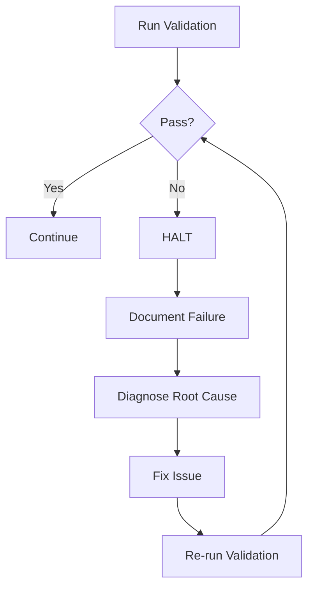
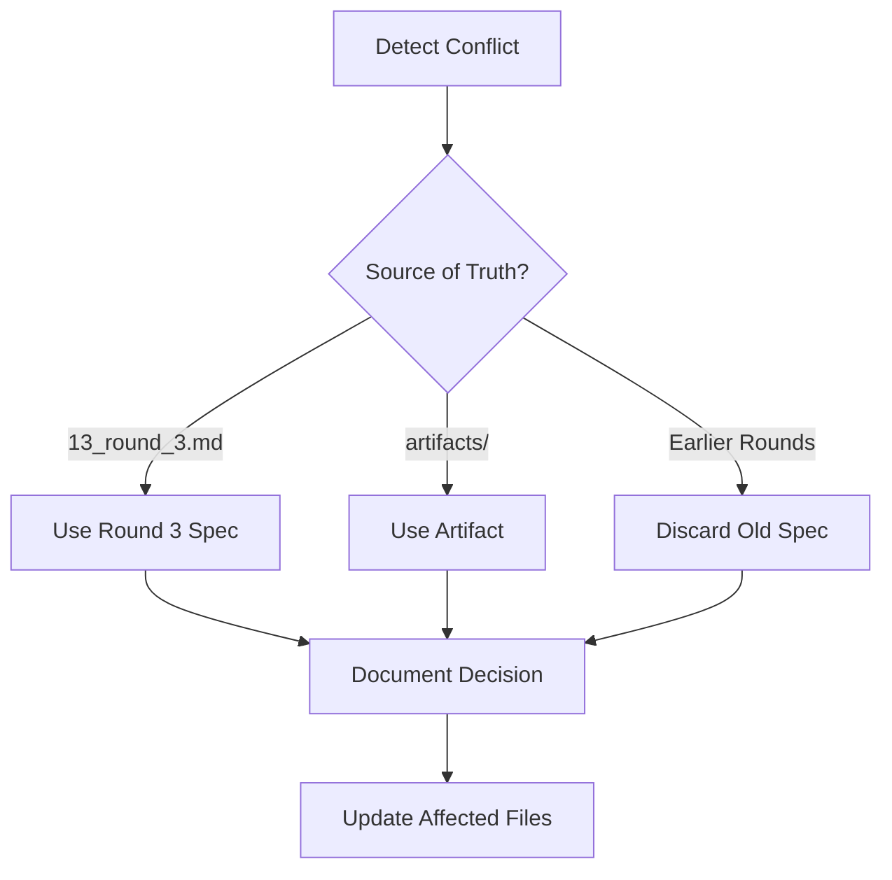

# Contract-Driven Integration (CDI) Infrastructure

**Version:** 2.0  
**Last Updated:** 2025-10-19  
**Repository:** ai-coding-platform (NEW)

---

## Overview

This document defines the Contract-Driven Integration (CDI) methodology used for AI-powered development of the AI Coding Platform. CDI ensures quality, traceability, and anti-drift through explicit contracts, evidence requirements, and validation gates.

---

## Core Principles

### 1. Discovery First
- **Never assume** - Always discover integration points before coding
- **Document findings** - Create discovery notes with code snippets
- **Verify compliance** - Check stack constraints before proceeding

### 2. Evidence-Based Progress
- **Every claim needs proof** - Tests pass, coverage met, artifacts generated
- **Artifacts are immutable** - SBOM, provenance, contracts are append-only
- **Validation gates** - Must pass before moving to next phase

### 3. Contract as Source of Truth
- **Contract defines success** - Wins, mustPass, exit criteria
- **No contract changes mid-phase** - Scope locked before execution
- **Evidence proves completion** - Artifacts validate contract claims

### 4. Anti-Drift Enforcement
- **Stack constraints locked** - No Python, no forbidden frameworks
- **Quality bars non-negotiable** - 80% coverage, zero warnings
- **Protected files** - Require approval to change governance files

---

## Contract Structure

### Phase Contract Schema

Every phase must have a contract following this structure:

```json
{
  "phaseId": "phase-0",
  "phaseName": "Foundation Scaffold",
  "description": "...",
  "dependencies": {
    "prerequisites": ["..."],
    "technologyStack": {
      "runtime": "Node.js 20.x",
      "language": "TypeScript 5.6.3",
      "...": "..."
    }
  },
  "wins": [
    {
      "step": 1,
      "win": "Repo initialized",
      "acceptanceCriteria": ["git log shows initial commit"],
      "implementation": "Run git init, create README.md, commit",
      "evidence": ["git log output"]
    }
  ],
  "mustPass": [
    {
      "validation": "npm run lint",
      "exitCode": 0,
      "rationale": "Zero warnings enforced"
    }
  ],
  "exitCriteria": {
    "allWinsComplete": true,
    "allMustPassValidations": true,
    "evidenceArtifactsGenerated": true
  },
  "estimatedEffort": "16-24 hours (AI time)",
  "riskLevel": "low"
}
```

### Contract Validation

All contracts must validate against schema:

```bash
npm install -g ajv-cli
ajv validate -s contracts/schemas/phase-contract.schema.json -d 00_phase0_new_repo_contract.json
```

---

## Artifact Types

### 1. Specifications (Inputs)
- **OpenAPI 3.1.0 specs** - API contracts (YAML)
- **Grafana dashboards** - Observability configs (JSON)
- **Database schemas** - Table definitions (SQL)
- **TypeScript templates** - Health checks, auth, etc.

**Validation**:
```bash
swagger-cli validate openapi/*.yaml
jq empty grafana/*.json
psql -f database/schema.sql --dry-run
npx tsc --noEmit *.ts
```

### 2. Evidence (Outputs)
- **SBOM** - Software Bill of Materials (SPDX, CycloneDX)
- **Provenance** - SLSA build attestations (in-toto JSONL)
- **Coverage reports** - Vitest HTML/JSON
- **Completion reports** - Phase summary with evidence

**Generation**:
```bash
npm run sbom              # sbom.spdx.json
npm run sbom:cyclonedx    # sbom.cdx.json
npm run provenance        # provenance.intoto.jsonl
npm test -- --coverage    # coverage/
```

### 3. Trace Files (Audit Trail)
- **`.automation/phase*_trace.jsonl`** - Timestamped action log
- **`.automation/phase*_fixes.md`** - Issues fixed during execution
- **`.automation/phase*_conflicts.md`** - Conflicts detected + resolutions

**Format**:
```json
{"timestamp": "2025-10-19T10:30:00Z", "action": "validate:openapi", "status": "success", "duration": 1.2}
{"timestamp": "2025-10-19T10:31:00Z", "action": "test", "status": "failed", "error": "Coverage below threshold"}
{"timestamp": "2025-10-19T10:35:00Z", "action": "test", "status": "success", "coverage": "82%"}
```

---

## Validation Gates

### Gate 1: Contract Validation
**Trigger**: Before phase execution starts  
**Check**: Contract validates against schema, all fields complete  
**Blocker**: Cannot proceed without valid contract

### Gate 2: Artifact Validation
**Trigger**: After reading artifacts, before implementation  
**Check**: All artifacts validate (OpenAPI, JSON, SQL, TypeScript syntax)  
**Blocker**: Must fix artifact errors before coding

### Gate 3: Win Completion
**Trigger**: After each win implementation  
**Check**: Acceptance criteria met, evidence collected  
**Blocker**: Cannot proceed to next win until current win validated

### Gate 4: MustPass Validations
**Trigger**: After all wins complete  
**Check**: All mustPass commands exit 0  
**Blocker**: Phase incomplete until all validations pass

### Gate 5: Evidence Generation
**Trigger**: After mustPass passes  
**Check**: SBOM, provenance, coverage reports generated  
**Blocker**: Cannot mark phase complete without artifacts

---

## Discovery Protocol

### Step 1: Understand Context
```bash
# Read all non-artifact files
cat VISION_CHEAT_SHEET.md
cat 13_round_3.md
cat CDI_INFRASTRUCTURE.md
cat AGENTS.md
```

### Step 2: Map Integration Points
```typescript
// Example: Before implementing S2S auth
grep -r "Authorization" services/  # Find existing auth patterns
grep -r "fetch(" services/bff/     # Find HTTP client usage
grep -r "middleware" services/*/   # Find Express middleware patterns
```

### Step 3: Document Findings
Create `.automation/phase*_discovery.md`:
```markdown
# Discovery Note - S2S Auth Implementation

## Integration Points

### BFF → Files Service Call
**File**: `services/bff/src/api/files.ts`
**Line**: 42-48
**Current Code**:
```typescript
const response = await fetch('http://files:8080/files', {
  headers: { 'X-User-Id': req.userId },
});
```

**Modification**: Add `Authorization: Bearer ${token}` header

### Files Service Auth Middleware
**File**: `services/files/src/middleware/auth.ts`
**Line**: 15-20
**Current Code**:
```typescript
app.use((req, res, next) => {
  req.userId = req.headers['x-user-id'];
  next();
});
```

**Modification**: Replace with JWT verification

## Dependencies
- `jose` (JWT library) - already in package.json
- `undici` (HTTP client) - already in package.json

## Stack Compliance
✅ TypeScript only
✅ No new dependencies
✅ Follows OAuth 2.1 (RFC 6749 + 9068)
```

---

## Quality Standards

### Code Quality
| Metric | Threshold | Tool | Command |
|--------|-----------|------|---------|
| Line Coverage | ≥80% | Vitest | `npm test -- --coverage` |
| Branch Coverage | ≥75% | Vitest | `npm test -- --coverage` |
| Type Safety | 100% | TypeScript | `npm run typecheck` |
| Lint Errors | 0 | ESLint | `npm run lint` |
| Lint Warnings | 0 | ESLint | `npm run lint` |

### API Quality
| Standard | Version | Validation | Command |
|----------|---------|------------|---------|
| OpenAPI | 3.1.0 | swagger-cli | `swagger-cli validate openapi.yaml` |
| RFC 9457 | Problem Details | Manual review | Check error responses |
| OAuth | 2.1 | Manual review | Check token endpoint |
| RFC 9068 | JWT Profile | jose library | Verify JWT claims |

### Contract Quality
| Check | Requirement | Validation |
|-------|-------------|------------|
| Schema Valid | Passes ajv | `ajv validate -s schema.json -d contract.json` |
| Wins Complete | All acceptance criteria met | Manual checklist |
| MustPass | All commands exit 0 | Run each command |
| Evidence | All artifacts generated | Check `.automation/` directory |

---

## Anti-Drift Rules

### Stack Constraints (Enforced)
```json
{
  "allowed": {
    "languages": ["TypeScript", "JavaScript"],
    "runtimes": ["Node.js 20.x"],
    "frameworks": {
      "frontend": ["Next.js 15.5", "React 19"],
      "backend": ["Express", "NestJS"],
      "testing": ["Vitest"]
    }
  },
  "forbidden": {
    "languages": ["Python", "Go", "Rust", "Java"],
    "frameworks": {
      "frontend": ["Vue", "Angular", "Svelte"],
      "backend": ["Django", "Flask", "Spring Boot"]
    }
  }
}
```

### File Extension Rules
```bash
# Allowed
*.ts, *.js, *.yaml, *.json, *.md, *.sql, *.mmd

# Forbidden
*.py, *.go, *.rs, *.java, *.jsx (use .tsx instead)
```

### Protected Files (Require Approval)
- `AGENTS.md`
- `CDI_INFRASTRUCTURE.md`
- `contracts/schemas/*.json`
- `.github/workflows/*.yml`
- `00_phase0_new_repo_contract.json`

---

## Error Handling

### Validation Failure Protocol



### Artifact Conflict Protocol



### Stack Violation Protocol

```bash
# Example: Python file detected
if ls *.py 2>/dev/null; then
  echo "ERROR: Python files forbidden in this repository"
  echo "Stack: TypeScript/JavaScript only"
  echo "See: AGENTS.md Stack Constraints"
  exit 1
fi
```

---

## Workflow Integration

### CI/CD Pipeline

```yaml
# .github/workflows/ci.yml
name: CI

on: [push, pull_request]

jobs:
  validate:
    runs-on: ubuntu-latest
    steps:
      - uses: actions/checkout@v4
      
      - name: Setup Node.js
        uses: actions/setup-node@v4
        with:
          node-version: '20'
      
      - name: Install dependencies
        run: npm ci
      
      - name: Validate contracts
        run: npm run contract:check
      
      - name: Lint
        run: npm run lint
      
      - name: Typecheck
        run: npm run typecheck
      
      - name: Test
        run: npm test -- --coverage
      
      - name: Validate OpenAPI
        run: npm run validate:openapi
      
      - name: Generate SBOM
        run: npm run sbom:all
      
      - name: Generate Provenance
        run: npm run provenance
      
      - name: Upload Evidence
        uses: actions/upload-artifact@v4
        with:
          name: evidence
          path: |
            sbom.spdx.json
            sbom.cdx.json
            provenance.intoto.jsonl
            coverage/
```

---

## Commands Reference

### Contract Management
```bash
# Validate contract
npm run contract:check

# Show current status (read-only)
npm run state:show

# Preview next suggested task
npm run state:next:dry

# Execute next task (interactive)
npm run state:next
```

### Validation Suite
```bash
# Run all validations (must pass before merge)
npm run validate:all

# Individual validations
npm run lint              # ESLint
npm run typecheck         # TypeScript
npm test                  # Vitest
npm run validate:openapi  # OpenAPI specs
```

### Evidence Generation
```bash
# SBOM
npm run sbom              # SPDX format
npm run sbom:cyclonedx    # CycloneDX format
npm run sbom:all          # Both formats

# Provenance
npm run provenance        # SLSA v1.0 in-toto JSONL

# Coverage
npm test -- --coverage    # HTML + JSON reports
```

### Infrastructure
```bash
# Local development
npm run dev               # Start docker-compose stack
docker-compose ps         # Check service health
docker-compose logs -f    # Tail logs

# Database
npm run db:migrate        # Apply migrations
npm run db:rollback       # Rollback last migration
npm run db:reset          # Drop + recreate + migrate
```

---

## Best Practices

### For AI Agents

1. **Read AGENTS.md first** - Understand stack constraints
2. **Follow discovery protocol** - Map integration points before coding
3. **Validate early, validate often** - Run checks after each change
4. **Document everything** - Create trace files, discovery notes, fix logs
5. **Trust the contract** - Don't deviate from wins/mustPass
6. **Generate evidence** - SBOM, provenance, coverage on completion

### For Human Reviewers

1. **Check contract validity** - Schema validation passes?
2. **Review discovery notes** - Integration points documented?
3. **Validate evidence** - All artifacts generated?
4. **Run mustPass validations** - All commands exit 0?
5. **Check trace files** - Any failures during execution?
6. **Verify stack compliance** - No forbidden tech introduced?

---

## Troubleshooting

### Common Issues

#### Contract Validation Fails
```bash
# Error: Contract doesn't match schema
ajv validate -s contracts/schemas/phase-contract.schema.json -d contract.json

# Fix: Check for missing required fields
# Required: phaseId, phaseName, description, dependencies, wins, mustPass, exitCriteria
```

#### OpenAPI Validation Fails
```bash
# Error: OpenAPI spec invalid
swagger-cli validate services/auth/openapi.yaml

# Fix: Check for:
# - Missing required fields (openapi, info, paths)
# - Invalid references ($ref paths)
# - Schema errors (type mismatches)
```

#### Test Coverage Below Threshold
```bash
# Error: Coverage 75% line (need ≥80%)
npm test -- --coverage

# Fix: Add tests for uncovered lines
# Check coverage/index.html for gaps
```

#### TypeScript Errors
```bash
# Error: Type errors in services/
npm run typecheck

# Fix: Check for:
# - Missing type annotations
# - Incorrect async/await usage
# - Unresolved imports
```

---

## Versioning

### Contract Versions
- **v1.0** - Initial CDI implementation (ai_system_executor-mvp)
- **v2.0** - Phase 0 for new repository (ai-coding-platform) ← **Current**

### Schema Versions
- **phase-contract.schema.json v1.0** - Base contract structure
- **artifact.schema.json v1.0** - Artifact metadata

---

## Contact & Governance

- **Methodology Owner**: @yousefbaragji
- **Repository**: ai-coding-platform (NEW)
- **Protected Files**: AGENTS.md, CDI_INFRASTRUCTURE.md, contracts/schemas/
- **Changes**: Require approval via CODEOWNERS

---

**This document defines the CDI methodology for the AI Coding Platform. All AI agents and human contributors must follow these rules.**
